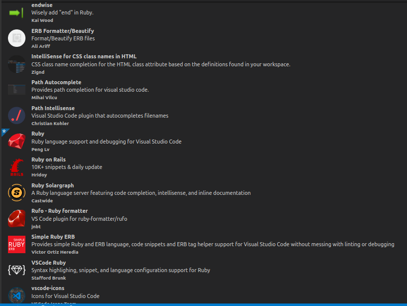

# 2 Setup

Before we begin developing our Rails application, the following softwares need to be installed:

- **Node.js**

  Rails uses a JavaScript package called webpack via the `webpacker` gem to manage and compile the frontend assets of our application. This requires a JavaScript runtime, and Node.js is that runtime.

- **Yarn**

  This is a package manager for Node that we will use to install our JavaScript dependencies. Rails uses yarn by default to install the dependencies for webpacker.

- **PostgreSQL**

  Rails comes with the sqlite database by default, but we will not be using it, since it is not suitable for production. It is recommended to develop with the same database that you will use in production.

  In this book, we will be using PostgreSQL as our database because it is a very powerful open-source database management system with lots of advanced features.

- **VSCode (optional but recommended)**

  This is an open-source, lightweight and fast code editor with support for various languages and frameworks through its numerous extensions.

## 2.1 Setting Up Linux Ubuntu

I will be using the Linux Ubuntu operating system in this book, therefore most of the installation instructions presented here are for Ubuntu. However, I have also provided some helpful links for setup instructions for windows 10 and macOS operating systems.

We are going to install ruby and node.js using the [asdf](https://asdf-vm.com/) version manager. `asdf` is an extendable version manager with support for Ruby, Node.js, Elixir, Erlang & more. It manages multiple language runtime versions on a per-project basis.

### Installing Git

Update package repositories

```bash
$ sudo apt-get update
```

Install dev dependencies

```bash
$ sudo apt install make libssl-dev libghc-zlib-dev \
 libcurl4-gnutls-dev libexpat1-dev gettext unzip
```

Install git

```bash
$ sudo apt install git
```

### Installing `asdf`

Clone asdf

```bash
$ git clone https://github.com/asdf-vm/asdf.git ~/.asdf \
 --branch v0.8.1
```

Update `bashrc`

```bash
$ echo -e '\n. $HOME/.asdf/asdf.sh' >> .bashrc
```

```bash
$ echo -e '\n. $HOME/.asdf/completions/asdf.bash' \
 >> ~/.bashrc
```

Restart your terminal and check if `asdf` installed correctly

```
$ asdf --version
```

The output should be `v0.8.1`

### Installing Node.js

Add the Node.js plugin

```bash
$ asdf plugin-add nodejs
```

Verify the Node installation files

```bash
$ bash ~/.asdf/plugins/nodejs/bin/import-release-team-keyring
```

Install Node version 14

```bash
$ asdf install nodejs 14.11.0
```

Configure `asdf` to use this version

```bash
$ asdf global nodejs 14.11.0
```

Verify that Node was installed successfully

```bash
$ node -v
```

You should see `v14.11.0` as the output

### Installing yarn

```bash
$ npm install --global yarn
```

Check yarn version

```
$ yarn --version
```

You should see `1.22.10` or similar as the output

### Installing Ruby

Install `ruby` using `asdf`

Add the Ruby plugin to `asdf`

```bash
$ asdf plugin-add ruby
```

Install version 3 of Ruby

```
$ asdf install ruby 3.0.1
```

Make version 3 the current ruby version

```
$ asdf global ruby 3.0.1
```

Check that ruby was installed correctly

```
$ ruby -v
```

Version '3.0.1' should be output

### Installing Rails

First lets install Bundler. A dependency management tool for Ruby.

```bash
$ gem install bundler
```

Now install rails

```
$ gem install rails -v 6.1.4
```

Restart the terminal and double-check that rails has been installed

```bash
$ rails -v
```

Output

```bash
Rails 6.1.4.1
```

### Installing PostgreSQL

We will install PostgreSQL using the apt repository.

First lets create the file repository configuration

```bash
$ sudo sh -c 'echo "deb http://apt.postgresql.org/pub/repos/apt $(lsb_release -cs)-pgdg main" > /etc/apt/sources.list.d/pgdg.list'
```

Import the repository signing key

```
$ wget --quiet -O - https://www.postgresql.org/media/keys/ACCC4CF8.asc | sudo apt-key add -
```

Update the package lists

```
$ sudo apt-get update
```

Install PostgreSQL version 12

```
$ sudo apt-get -y install postgresql-12 libpq-dev
```

Enter password when prompted

`[sudo] password for username: [password]`

Start the postgresql server

```bash
$ sudo service postgresql start
```

For more info on installing PostgreSQL on linux visit this [link](https://www.postgresql.org/download/linux/ubuntu/)

Create a PostgresSQL account where the account's username is equal to the system's username. This will enable us to create Rails databases with just one commands (`rails db:create`).

```bash
$ sudo su - postgres -c "createuser `whoami` --superuser"
```

### Install VSCode

```bash
$ sudo snap install code --classic
```

Install the `solargraph` gem for Ruby language server

```bash
$ gem install solagraph
```

Install the `rufo` gem for Ruby formatting

```bash
$ gem install rufo
```

Install the following extensions for VSCode



## 2.2 For MacOS and Windows 10

**Note:** The previous setup instructions apply for ubuntu 18.04 (or later). For macOS and Windows, use the following links.

For windows [use this link](https://gorails.com/setup/windows/10)

For macOS [use this link](https://gorails.com/setup/osx/11.0-big-sur)
