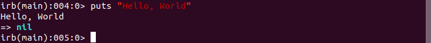
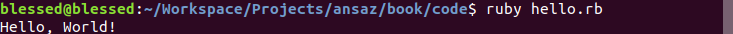
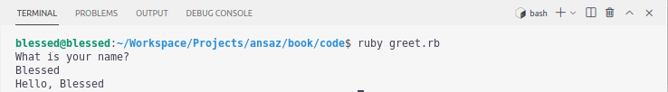
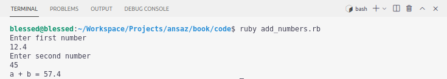

# Ruby Basics

Ruby is a general purpose, dynamic and object-oriented language created in 1993 by Yuhikiro Matsumoto. Unlike C or Java which are compiled languages, Ruby is an interpreted language.

## Running ruby in `irb`

To start the ruby interpreter, open the terminal and run

```bash
$ irb --simple-prompt
```

Inside `irb`

```ruby
>> puts "Hello World"
```



A ruby comment starts with a `#` symbol. Comments are ignored by the ruby interpreter.

`puts` is a method that prints out a string to the standard output (the terminal in this case). It takes in a string to be printed.

To exit from `irb` type `exit` and press enter (or Return)

## Running a ruby source file

Create a directory to hold our code files

```bash
$ mkdir ruby-basics

$ cd ruby-basics
```

Now create a file to hold our 'Hello, World' program. Ruby source files end with a `.rb` extension.

```bash
$ touch hello.rb
```

Write the following code inside `hello.rb`

```ruby
puts "Hello, World!"
```

To run a ruby program, type `ruby` followed by the filename containing the program.

```bash
$ ruby hello.rb
```



## Strings

Strings in Ruby can be double-quoted or single-quoted. However, single-quoted strings in ruby do not allow for string interpolation (i.e we cannot inject variables in a single-quoted string to make it dynamic). Double-quoted strings on the other hand allow for string interpolation.

```bash
touch greet.rb
```

Inside `greet.rb`, type the following code

```ruby
puts "What is your name?"

# get input from the user and store it the name variable
name = gets

# greet the user
puts "Hello, #{name}"  # note the string interpolation
```

Run the program

```bash
ruby greet.rb
```



`gets` is a method in ruby that gets input from the user.

Try out the following examples in `irb` to learn more string methods

```ruby
name = "Blessed"

# Convert the string to lowercase
puts a.downcase # outputs "blessed"

# Convert the string to uppercase
puts a.upcase # outputs "BLESSED"

# Reverse the string
puts a.reverse # ouputs "desselB"

# You can also chain methods in ruby
puts a.reverse.upcase # ouputs "DESSELB"

# Convert the string to an array
puts a.split("") # outputs ["B", "l", "e", "s", "s", "e", "d"]
```

## Numbers

Ruby supports different kinds of nsumbers: Integers, Floats, Decimals and Complex Numbers.

Lets create a program to add two numbers together

```bash
touch add_numbers.rb
```

`add_numbers.rb`

```ruby
puts "Enter first number"

a = gets.to_f

puts "Enter second number"

b = gets.to_f

total = a + b

puts "a + b = #{total}"
```

Run the program

```bash
ruby add_numbers.rb
```



`gets` returns the user input as a String. To convert from a string to a float (a real number), Ruby provides the `to_f` method.

To convert a value to an Integer use `to_i`

```ruby
puts "23".to_i     # Outputs 23

puts 10.5.to_i     # Outputs 10
```

Try the following code samples in irb to do basic math operations in Ruby.

```ruby
a = 30
b = 20
# add two numbers
puts a + b

# subtract two numbers
puts a - b

# multiply two numbers
puts a * b

# perform integer division
puts a / b

# perform float division (i.e actual division)
puts a / b.to_f

# Get a square root of a number
puts Math.sqrt(a)
```

Note that in the last statement in the code samples above, we are using a `sqrt` method from the `Math` module. Methods in ruby are defined inside modules(or classes). The `puts` and `gets` methods we used previously are defined inside the `Kernel` module which is accessible by default in a Ruby program.

```ruby
Kernel.puts "Hello, World"

# the 'Kernel' methods are directly accessible in a ruby program
# therefore there is no need to prefix the call to 'puts' with the 'Kernel.'

puts "Hello, World"
```

Try out more examples

```ruby
a = 3.567

# Round to two decimal places
puts a.round(2) # outputs 3.57

# Round to the nearest integer
puts a.round # outputs 4
```

## Booleans

A boolean is either `true` or `false`. Booleans are used especially in conditionals to check the truthiness of an expression.

Try out the following examples in `irb` to learn the conditional statements.

```ruby
>> tired = true
=> true
?> if tired
?>  puts "Take some rest"
>> end
```

Output

```
Take some rest
=> nil
```

```ruby
age = 16

if age >= 16
  puts "You can drive"
else
  puts "You cannot drive"
end

# `unless` is the opposite of `if`

unless tired
  puts "Keep on working"
end

# if you have multiple conditions, you can use the `case` statement
score = 81
case score
  when 90..100
    puts "Excellent work"
  when 80..90
    puts "Good work"
  when 70..80
    puts "Above average"
  when 60..70
    puts "Pass"
  else
    puts "Fail"
  end
```

The expression `90..100` is an inclusive range, so the first branch will evaluate when `(90 <= score <= 100)`. Another type of range is written like so `90...100`, this range does not include the upper bound (it only covers values 90 to 99). Any conditional expression (including regular expressions) can be used in a case statement.

## Arrays

Arrays in ruby can hold objects of different data types and they dynamically shrink or grow in size depending on the number of inserted items

Try out the following in `irb`

```ruby
random_array = [1,3, "Blessed", 4.5, true]

# Get the size of the array
puts random_array.size

# Retrieve the first item of an array
puts random_array.first


# the last item
puts random_array.last

# Print all the items in the array
random_array.each do |item|
  puts item
end

# Convert a range to an Array
my_range = 1..10

# use the `to_a` method on the Range
my_range.to_a # outputs [1, 2, 3, 4, 5, 6, 7, 8, 9, 10]

# join the items in an array
fruits = ["grape", "banana", "orange", "mango"]

# use the `join` method on the Array
puts fruits.join(" and ") # outputs "grape and banana and orange and mango"
```

The `each` method passes the successive elements of an Array into a block. The `do` `end` construct in the example above marks a ruby `block`.

## Hashes

A hash holds key-value pairs

```ruby
# Creating a hash

my_hash = {a: 12, b: 45}

# You can look up values by their keys

puts my_hash[:a] # outputs 12

puts my_hash[:b] # outputs 45

# Looking up a non-existent key in a Hash returns nil
puts my_hash[:c] # ouputs nil

# Change a hash item
my_hash[:b] = 20

puts my_hash[:b] # outputs 20

# Add new item
my_hash[:f] = "Something Else"

puts my_hash[:f] # outputs "Something Else"

# print the values in a hash
my_hash.each do |key, value|
  puts "key = #{key} and value = #{value}"
end
```

The `each` method of a hash `yields` two values to the block for each iteration (i.e the key and the value).

## Methods

Methods are used to hold pieces of code for reuse. The following example uses

```ruby
def greet_user
  puts "Hello User"
end

greet_user # outputs "Hello User"
```

Methods can also accept parameters

```ruby
def greet2(name)
  puts "Hello #{name}"
end

greet2 "Blessed" # outputs "Hello Blessed"
```

Methods can also return values

```ruby
def add(a, b)
  a + b
end

# assign the return value of the method to a variable
total = add(10, 5)
puts total # outputs 15
```

The last expression of a ruby method is the return value of the method, so an explicit `return` keyword is not usually required.

## Classes

Ruby is an object-oriented language, everything is an object in Ruby. Even the booleans `true` and `false` are regarded as objects. Every object has a class. A class is a blueprint for an object. Classes can inherit/subclass each other forming a parent-child relationship. `BasicObject` is the parent class of all objects in Ruby.

```ruby
# create a class
class Animal
end

# create an animal object
# the new method of a class is used to instantiate a new object from the class
lion = Animal.new

# check the class of the object
puts lion.class # output "Animal"

# you can define methods in a class
# the initialize method is called when an object is created from a class
class Animal
  # The variables that start with '@' are called instance variables.
  # Instance variables are accessible from within the class and they belong to the instance.
  def initialize(name)
    @name = name
  end

  def name
    @name
  end
end

lion = Animal.new("Simba")

# call the method `name` to return the instance variable `@name`
puts lion.name # outputs "Simba"

# create another class
class Person
  attr_reader :name, :age
  def initialize(name, age)
    @name = name
    @age = age
  end
end

p1 = Person.new("Blessed", 25)
puts p1.name # outputs "Blessed"
puts p1.age # outputs 25
```

`attr_reader` is a method that creates getter methods to return the related instance variable.

The following expression

```ruby
attr_reader :age
```

Dynamically creates the following method in the class

```ruby
def age
  @age
end
```

Classes can be openned in Ruby to add new features and methods.

```ruby
# lets re-open the Person class to add a `name` setter
class Person
  def name=(name)
    @name = name.capitalize
  end
end

p1.name = "michael"
puts p1.name # outputs "Michael"
```

Methods in ruby can end with punctuation signs such as '?' and '='

`attr_writer` just like `attr_reader` creates a setter method for an instance variable automatically.

Lets modify the `Person` class to include a setter for the 'age' using `attr_writer`

```ruby
class Person
  attr_writer :age
end

# set the age to another value
p1.age = 35
puts p1.age # outputs 35
```

`attr_accessor` is a combination of `attr_reader` and `attr_writer`

```ruby
class Car
  attr_accessor :model, :make
end

c1 = Car.new
c1.model = "Fit"
c1.make = "Honda"

puts c1.model # outputs "Honda"
puts c1.make # outputs "Fit"
```

Classes can inherit from each other

```ruby
class Animal
  attr_accessor :name, :sound
  def initialize(name, sound)
    @name = name
    @sound = sound
  end
end

# define a dog class that subclasses 'Animal'
# the Dog class inherits all the methods defined in its parent
class Dog < Animal
end

d = Dog.new("Spot", "bark")
puts d.name # outputs "Spot"
puts d.sound # outputs "bark"

# child classes can override parent methods

class Dog < Animal
  attr_accessor :color
  def initialize(name, sound, color)
    super # `super` calls the parent class' initialize method
    @color = color
  end
end

# Now a dog has a color
d = Dog.new "Spot", "bark", "brown"
puts d.color # outputs "brown"
```

## Modules

Modules are used to organize related methods and classes.

```ruby
module MyModule
  def greet
    puts "Hello"
  end
end

# methods in a module can be included in a class
class MyClass
  include MyModule
end

m = MyClass.new

# call the module method
m.greet # outputs "Hello"
```

Modules are also used to namespace classes and methods.

```ruby
class Library
  class Book
    attr_accessor :title

    def initialize(title)
      @title = title
    end
  end
end

book = Library::Book("Concise Rails")
puts book.title # outputs "Concise Rails"
```

## Blocks

A ruby **block** is a way of grouping statements and it appears adjacent to a method call; the block is written starting on the same line as the method call's last parameter (or the closing parenthesis of the parameter list). The ruby standard is to use braces for single-line blocks and do..end for multi-line blocks. Inside the method, you can call the block using the `yield` keyword with a value.

```ruby
# define a method that calls a block
def my_block
  yield
end

# call the method with a block
my_block { puts "Hello there" } # braces syntax

# do..end syntax
my_block do
  puts "What is your name"
  name = gets
  puts "Hello #{name}"
end

# You can also provide parameters to `yield` and these
# will be passed to the block
def my_other_block
  yield("Blessed", 25)
end

my_other_block do |name, age|
  puts "#{name} is #{age} years old"
end
```

Most methods in Ruby accept blocks. The following are a few examples

```ruby
# perform an operation 5 times
# `times` is an method on integers (i.e defined in the Integer class)
# `times` accepts a block and it executes it a given number of times
5.times do
  puts "Hello there"
end

# 'times' can also yield a parameter to a block
# This parameter varies from 0 - (n-1) where n is the Integer
5.times do |i|
  puts "Iteration #{i}"
end

# Array `each` method yields successive items of an Array to a block
[1,3,4].each do |num|
  puts num
end
```

## Symbols

A symbol is generally used as a unique identifier. You will see heavy usage of symbols when we start to talk about rails. A symbol like an number is immutable, i.e it doesn't change. Just like 2 will always be 2, also the symbol :a will always be :a (i.e same `object_id`)

```ruby
# Creating a symbol

:name

:name.class # outputs "Symbol"

# strings are mutable
"a".object_id # outputs 13400

# the string "a" changes
"a".object_id # outputs 13420

# symbols are immutable
:a.object_id # outputs 780508

# the symbol :a doesn't change
:a.object_id # outputs 780508
```
