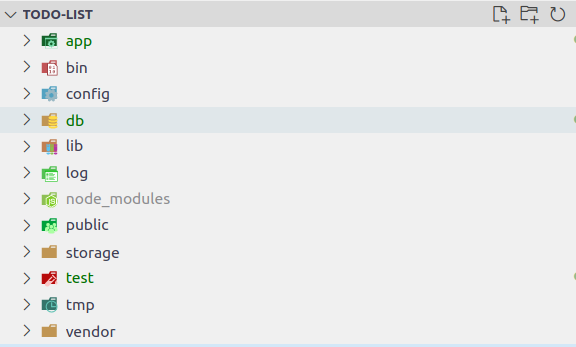
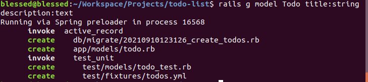
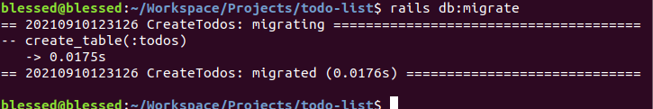
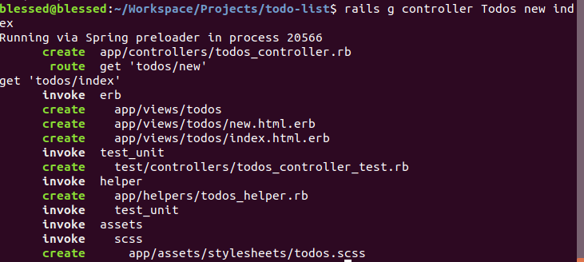

## Rails Basics

Now we have covered the basics of Ruby, we are now ready to move into Rails.

Lets install Rails

```bash
gem install rails -v 6.1.4
```

To create a new rails project, you use the following syntax

```bash
rails new {project_name} <options>
```

Lets a create a simple project to manage a list of the tasks we want to do.

Before we create a rails project, we need to install a database. Rails uses sqlite3 by default, but we dont want to use that, as it is not suitable for production. It is recommended to develop with the same database as you would use in production.

In this book, we will be using PostgreSQL as our database because it is a very powerful and open-source database management system with lots of advanced features

### Install PostgreSQL in Ubuntu

```bash
# Create the file repository configuration
sudo sh -c 'echo "deb http://apt.postgresql.org/pub/repos/apt $(lsb_release -cs)-pgdg main" > /etc/apt/sources.list.d/pgdg.list'

# Import the repository signing key
wget --quiet -O - https://www.postgresql.org/media/keys/ACCC4CF8.asc | sudo apt-key add -

# Update the package lists
sudo apt-get update

# Install PostgreSQL version 12
sudo apt-get -y install postgresql-12 libpq-dev

`[sudo] password for username: [password]`

# Enter password when prompted
```

**To install PostgreSQL in MacOS and Windows 10, use the following links**

1. For MacOS **[click here](www.postgresqltutorial.com/install-postgresql-macos/)**
2. For Windows 10 **[click here](www.2ndquadrant.com/en/blog/pginstaller-install-postgresql/)**

```bash
rails new todo_list -d postgresql

# cd into project
cd todo_list

# create database
rails db:create

# Run the development server
rails server
```

### Application Structure

This is the application structure of rails application



**app** - for models, controllers, views and other components of our rails application. We will spend most of our time in this directory.

**bin** - contains the executables for our project such as (webpack, rails, rake, yarn etc.)

**config** - for the configuration files (e.g routes, initializers) for our application.

**db** - contains database migration and seed files

**lib** - will contain our Ruby code libraries that don't fit properly in either models, controllers or concerns.

**log** - contains the log files

**node_modules** - contains the javascript modules installed from npm.

**public** - everything in this directory is served directly by our rails server.

**storage** - for uploaded files

**test** - for test code

**tmp** - for temporary files

### Todo Model

Create a model to hold the Todo items. A model in rails is a ruby class that inherits from ActiveRecord. ActiveRecord is a database access layer for Rails. Because it inherits from Active Record, a rails model can access and communicate seamlessly with a database.

An active record model represents a database column. An active record instance represents a database row.

To create a rails model, you use the following syntax

```bash
rails model {model_name} <field_1:type> <field_2:type> ... <field_n:field>
```

A todo item will have a title and a description.

```bash
rails g model Todo title:string description:text
```

This command generates the following files:

- migration file - which contains changes to be made to the database

- model file - which contains an active-record model that is reponsible for interacting with the database

- test file - for tests

- fixtures file - for adding test data to the database



### Todo Model

`app/models/todo.rb`

```ruby
class Todo < ApplicationRecord
end
```

The `Todo` model inherits from `ApplicationRecord` which inturn subclasses the `ActiveRecord` class. Infact, all our database models inherit from `ApplicationRecord`

`app/models/application_record.rb`

```ruby
class ApplicationRecord < ActiveRecord::Base
  self.abstract_class = true
end
```

Application is an abstract class, meaning that it doesn't represent a database table. It only provides database access features to its children (the subclasses that represent database tables)

### CreateTodos Migration

A migration file describes the changes that should be made to the database. Migration files live in the `db/migrate` directory.

A migration file is prefixed with a timestamp for when it was created. This helps in keeping the history of the database and for rails to know the order of the migrations when migrating the database up or rolling it back.

Rails intelligently determines the name of the migration class based on the database table being created. For instance, in this case we are creating a `Todo` model, so rails will know that it has to create a table named `todos` in the database. (The convention of Rails is to name the database table using the plural name of the model). Because creating a new model creates a new table, rails will name the class of the migration `CreateTodos` (to denote that the migration is creating a `todos` database table)

Let's examine the generated migration file.

`db/migrate/{timestamp}_create_todos.rb`

```ruby
class CreateTodos < ActiveRecord::Migration[6.1]
  def change
    create_table :todos do |t|
      t.string :title
      t.text :description

      t.timestamps
    end
  end
end
```

The `change` or `up` or `execute` method of a migration is exceuted when the migration is applied. Inside this method, we describe the changes we want to be made to the database.

In our `CreateTodos` migration inside the `change` method, we call a method called `create_table`. `create_table` creates a new database table and it yields the table object to the block which is then used to define the columns we want.

`t.string :title` - means that we are creating a `VARCHAR` column named 'title'. This column will hold the titles of our todo items.

`t.text :description` - creating a description column of type `TEXT` in our database

`t.timestamps` - creates the `created_at` and `updated_at` fields that are automatically updated when the model is created or modified.

Now let's run the migration (ensure that you are in the root directory for the project)

```bash
rails db:migrate
```

The output will show that a `todos` database table was created.



After the first migration is applied, the `db/schema.rb` file will be created and populated with the state of the database

`db/schema.rb`

```ruby
ActiveRecord::Schema.define(version: 2021_09_10_123126) do

  # These are extensions that must be enabled in order to support this database
  enable_extension "plpgsql"

  create_table "todos", force: :cascade do |t|
    t.string "title"
    t.text "description"
    t.datetime "created_at", precision: 6, null: false
    t.datetime "updated_at", precision: 6, null: false
  end

end
```

As you can see from the schema file, our database has a `todos` table with four fields (the `title`, `description`, `created_at` and `updated_at`). The schema file shows the current status of the database

With each migration applied, the schema file is updated by rails to always reflect the current status of the database. This file is used to re-create the database.

Now that our migration is applied, let's play with ActiveRecord a little. To do this, we will use a `rails console` which is essential an `irb` console but with the Rails environment in it.

Open the rails console

```bash
rails console
```

```ruby
# create a new todo in memory
# an active record model is instantiated by using the 'new' method just like any other ruby class.
# it accepts the field values as arguments to the 'new' method
todo1 = Todo.new(title: "Watch TV", description: "Watch my favo
rite TV show")

# the todo is not yet saved to the database so its id is nil
puts todo1.id # outputs nil

puts todo1.persisted? # outputs false

# to save the todo in the database, call save
todo1.save

# now the todo has an id

puts todo1.id # outputs 1

puts todo1.persisted? # outputs true

# an activerecord instance can be initialized and persisted to the database in one fell swoop using the `create` method

# lets create another todo
todo2 = Todo.create(title: "Read a book", description: "Finish off chapter 5 of Concise Rails 6")

puts todo2.id # outputs 2

# To get all todos from the database run the 'all' method
todos = Todo.all

# Get the number of todos
puts Todo.count # outputs 2

# Get a todo by id
t = Todo.find(1)

# if the id is not found, an `ActiveRecord::RecordNotFound` exception
# is raised. We will talk more about handle exceptions later.

# search for todo whose title is 'Read a book'

t2 = Todo.where(title: 'Read a book')

# update a todo
t2.title = 'Read a very good book'

t2.save

# destroy a todo
t2.destroy

# now only 1 todo is left
Todo.count # outputs 1

# now lets create another todo (but with an empty title and description)

blank_todo = Todo.new

blank_todo.save
```

The blank todo was saved to the database without any problems. However, this is not a good thing as a blank todo is meaningless. We define validations inside the model To prevent invalid data in our models.

The first validation we want to add to both the `title` and the `description` is the `presence` validation. This validation ensures that a field is not blank, otherwise an error is raised and the model is prevented from being inserted into the database.

`todo.rb`

```ruby
class Todo < ApplicationRecord
  validates :title, presence: true
  validates :description, presence: true
end
```

The `validates` method accept a field name and a list of validation options. With this code in place, our todos cannot be saved without a `name` or a `description`.

Lets try it out in the `rails console`

```ruby
# reload the console
!reload

blank_todo = Todo.new
blank_todo.save # outputs false

# check the valid? status of the model
blank_todo.valid? # false

# check the errors
blank_todo.errors # a hash with errors is return

# get the full error messages
blank_todo.errors.full_messages

# output => ["Title can't be blank", "Description can't be blank"]

# now lets add the title and description and re-save the model again
blank_todo.title = 'Some title'

# check the error messages again
blank_todo.errors.full_messages

# output => ["Description can't be blank"]

# the title error message is now gone

blank_todo.description = 'Some description'

blank_todo.save # outputs true
```

the `save` method of the active record model returns `true` if a model is saved successfully to the database and `false` if it isn't.

Lets add another validation to ensure that our todo titles are unique thorugh out the database.

`todo.rb`

```ruby
class Todo < ApplicationRecord
  validates :title, presence: true, uniqueness: true
  validates :description, presence: true
end
```

We simply add the uniqueness option to the `validates :title` line. You can now `reload!` the `rails console` and check that you can no longer have todos with the same titles. With just a few lines of code, we have made our model robust and protected our database from having invalid meaningless data. This is the power of Rails!.

### Creating a Controller

Now lets create a controller to orchestrate the application when a user makes a request to our application.

The general syntax for creating a controller is as follows:

```bash
rails g controller {controller_name} <action1> <action2>
```

```bash
rails g controller Todos new index
```

This following files/folders are generated:

- controller file - contains the controller class

- controller test file - contains the test code for the controller

- helper file - contains helpers module

- views files - these contain the `erb` templates for data representation. A view file is created for each action.



Update the todos controller
`todos_controller.rb`

```ruby
class TodosController < ApplicationController
  def new
    @todos = Todo.new
  end

  def index
    @todos = Todo.all
  end

  def create
    @todo = Todo.new(todo_params)
    if @todo.save
      redirect_to todos_url, notice: "Todo created successfully"
    else
      render "new"
    end
  end

  private

  def todo_params
    params.require(:todo).permit(:title, :description)
  end
end
```

A controller's public methods are known as actions. Actions are methods that handle user requests. Lets examine the newly created actions more closely:

- `new` - this action sets a new empty todo item as an instance variable (@todo). Remember, an instance variable is accessible throughout the class and it belongs to a class instance. After creating a new todo item, if a `render` or `redirect_to` method is not called, Rails will by default render a view that has the same name as the action. So in this case, a `new.html.erb` file inside `app/views/todos` is rendered.

- `index` - this action retrieves all the todo items from the database and places them inside `@todos` instance variable. The instance variables of a controller are directly accessible from the view. (i.e the instance variables in the `index` action are accessible in `app/views/todos/index.html.erb`). By default, since the `render` or `redirect_to` method is not called in the `index` action, rails will render the `app/views/todos/index.html.erb` template.

- `create` - this action creates a new todo item from the `todo_params` hash. The `todo_params` itself is defined as a private method in the controller so that it doesn't appear as an action and also because its only used within the `TodosController` only. Private methods in a ruby class are only accessible from within that class. The `todo_params` implements strong parameters in that it only allows a todo `title` and `description` to be passed to the model initializer. This makes the application secure by preventing malicious users from manipulating the form and submitting extra dangerous data. If the form is valid, we redirect to a `todos_url` with a flash message saying that the Todo was created successfully.

An action is a controller method that handles a request.
s
