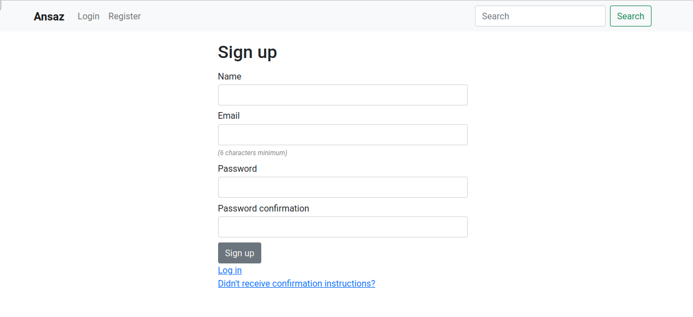
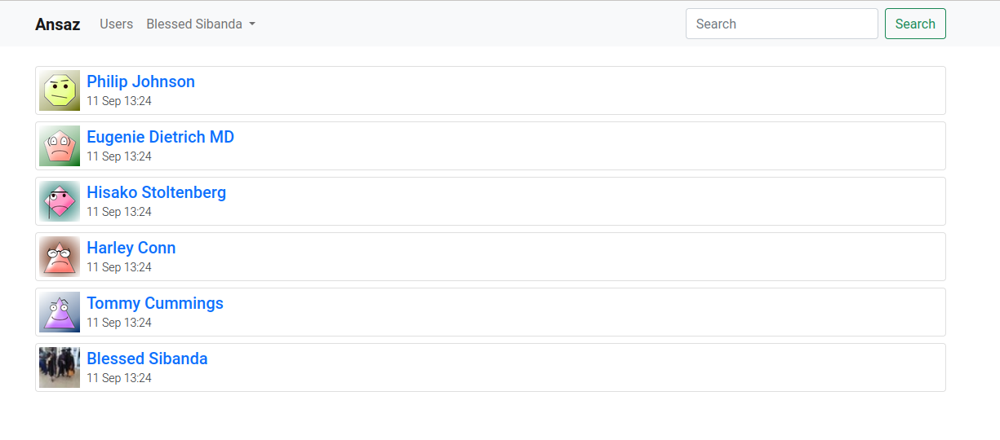

# 4 User Authentication

In this chapter we are going to build an authentication system for our application. We will use [devise](https://github.com/heartcombo/devise) for user authentication. Devise is a very popular gem for authenticating users in rails applications. It provides all the features required to build a robust authentication system in a modern web app.

## 4.1 Setup Devise

```bash
$ bundle add devise
$ rails g devise:install
```

Add default url mailer options to `config/environments/development.rb` and `config/environments/test.rb`

```ruby
Rails.application.configure do
  ...
  ...

  config.action_mailer.default_url_options = {
    host: "localhost",
    port: 3000,
  }
end
```

`config/environments/test.rb`

```ruby
Rails.application.configure do
  ...
  ...

  config.action_mailer.default_url_options = {
    host: "ansaz.domain"
  }
end
```

Restart the server

```
$ rails restart
```

Create home controller

```bash
$ rails g controller Home index
```

Root to home-controller index action in `config/routes.rb`

```ruby
Rails.application.routes.draw do
  root to: "home#index"
end
```

Update the home-controller test to use `root_url` instead of `home_index_url`

```ruby
require "test_helper"

class HomeControllerTest < ActionDispatch::IntegrationTest
  test "should get index" do
    get root_url
    assert_response :success
  end
end
```

Run the tests,

```bash
$ bin/rails db:migrate RAILS_ENV=test
$ rails t
```

The tests will fail, because of a missing `rexml` gem. Let's install that gem.

```bash
$ bundle add rexml
```

Now if we re-run the tests, they should pass as expected and the following output is produced.

```
Running via Spring preloader in process 23903
Run options: --seed 47206

# Running:

.

Finished in 0.402932s, 2.4818 runs/s, 2.4818 assertions/s.
1 runs, 1 assertions, 0 failures, 0 errors, 0 skips
```

Add the flash messages inside the `body` tag in `app/views/layouts/application.html.erb` layout

```html
<!DOCTYPE html>
...
<body>
  <p class="notice"><%= notice %></p>
  <p class="alert"><%= alert %></p>
  ...
</body>
...
```

Generate the devise views

```bash
$ rails g devise:views
```

Generate devise user model

```bash
$ rails g devise User
```

Make the following changes to `db/migrate/{timestamp}_devise_create_users.rb` migration file

- Uncomment the _Trackable_ and _Confirmable_ sections

* Add the `name` string field to store the name of the user

* Add the `about` text field to store the about information of the user

The resulting file should look like this

```ruby
class DeviseCreateUsers < ActiveRecord::Migration[6.1]
  def change
    create_table :users do |t|
      ## Database authenticatable
      t.string :email, null: false, default: ""
      t.string :encrypted_password, null: false,\
        default: ""
      t.string :name, null: false, default: ""
      t.text :about, null: true

      ## Recoverable
      t.string :reset_password_token
      t.datetime :reset_password_sent_at

      ## Rememberable
      t.datetime :remember_created_at

      ## Trackable
      t.integer :sign_in_count, default: 0, null: false
      t.datetime :current_sign_in_at
      t.datetime :last_sign_in_at
      t.string :current_sign_in_ip
      t.string :last_sign_in_ip

      ## Confirmable
      t.string :confirmation_token
      t.datetime :confirmed_at
      t.datetime :confirmation_sent_at
      t.string :unconfirmed_email

      t.timestamps null: false
    end

    add_index :users, :email, unique: true
    add_index :users, :reset_password_token, unique: true
    add_index :users, :confirmation_token, unique: true
  end
end
```

Also, enable `:trackable` and `:confirmable` modules to devise user model in `app/models/user.rb`

```ruby
class User < ApplicationRecord
  devise :database_authenticatable, :registerable,
         :recoverable, :rememberable, :validatable,
         :confirmable, :trackable
end
```

Migrate the database

```bash
$ rails db:migrate
```

You will notice that the `annotate` gem will add comments in all model related files to show all the database column names in the model.

Run the development server

```bash
$ rails s
```

## 4.2 Add styling

We are going to use Bootstrap CSS styling to achieve a consistent and responsive design.

Install `bootstrap` and `popperjs` from npm

```bash
$ yarn add bootstrap@next
$ yarn add @popperjs/core
```

Create stylesheets directory inside `app/javascript`

```bash
$ mkdir app/javascript/stylesheets
$ touch app/javascript/stylesheets/main.scss
```

Import bootstrap in `main.scss`

```scss
@import 'bootstrap';
```

Import `main.scss` and `bootstrap.min.js` in `app/javascript/packs/application.js`

```javascript
import Rails from '@rails/ujs';
import Turbolinks from 'turbolinks';
import * as ActiveStorage from '@rails/activestorage';
import 'channels';

Rails.start();
Turbolinks.start();
ActiveStorage.start();

import '../stylesheets/main.scss';
import 'bootstrap/dist/js/bootstrap.min';
```

Change the `webpack-dev-server` version from 4 to version 3 in `package.json`.

```json
{
  "name": "ansaz",
  "private": true,
  "dependencies": {
    "@popperjs/core": "^2.10.1",
    "@rails/actioncable": "^6.0.0",
    "@rails/activestorage": "^6.0.0",
    "@rails/ujs": "^6.0.0",
    "@rails/webpacker": "5.4.2",
    "bootstrap": "^5.0.0-beta3",
    "turbolinks": "^5.2.0",
    "webpack": "^4.46.0",
    "webpack-cli": "^3.3.12"
  },
  "version": "0.1.0",
  "devDependencies": {
    "webpack-dev-server": "^3"
  }
}
```

Run yarn install

```
$ yarn
```

Run webpack dev server

```bash
$ ./bin/webpack-dev-server
```

Install [bootstrap_form](https://github.com/bootstrap-ruby/bootstrap_form) gem to automatically style our forms with bootstrap.

```bash
$ bundle add bootstrap_form
```

Update the devise views

- Replace all `form_for` in all files in `app/views/devise` folder with `bootstrap_form_for`

- Remove all `f.label` tags in all files in `app/views/devise` folder

- Remove all `<br />` tags from devise forms

The login page (i.e `app/views/devise/sessions/new.html.erb`) should look like

```erb
<h2>Log in</h2>
<%= bootstrap_form_for(resource, as: resource_name,
 url: session_path(resource_name)) do |f| %>
  <div class="field">
    <%= f.email_field :email, autofocus: true,
     autocomplete: "email" %>
  </div>
  <div class="field">
    <%= f.password_field :password,
      autocomplete: "current-password" %>
  </div>
  <% if devise_mapping.rememberable? %>
    <div class="field">
      <%= f.check_box :remember_me %>
    </div>
  <% end %>
  <div class="actions">
    <%= f.submit "Log in" %>
  </div>
<% end %>
<%= render "devise/shared/links" %>
```

Now our forms are styled properly with bootstrap

Add margin to all form submit buttons in `app/javascript/stylesheets/main.scss`. Also give help text in all forms with smaller font size and gray color.

```scss
@import 'bootstrap';

input[type='submit'] {
  margin-top: 0.6em;
}

form {
  em,
  i {
    color: gray;
    font-size: 0.75rem;
  }
}
```

Add `btn btn-danger` class to 'cancel my account' button in edit user form in `app/views/devise/registrations/edit.html.erb`. Also add a top margin to the `h3` 'Cancel my account' header

```erb
...
<h3 class='mt-4'>Cancel my account</h3>
<p>Unhappy? <%= button_to "Cancel my account",
  registration_path(resource_name),
  data: { confirm: "Are you sure?" }, method: :delete,
  class: 'btn btn-danger' %></p>
...
```

Reduce font sizes in devise 'error-messages' partial in `app/views/devise/shared/_error_messages.html.erb` by changing it to the following.

```erb
<% if resource.errors.any? %>
  <div id="error_explanation">
    <h2 class='h6'>
      <%= I18n.t("errors.messages.not_saved",
                 count: resource.errors.count,
                 resource: resource.class.model_name.human.downcase)
       %>
    </h2>
    <ul>
      <% resource.errors.full_messages.each do |message| %>
        <li class='small'><%= message %></li>
      <% end %>
    </ul>
  </div>
<% end %>
```

## 4.3 Using partials

Create a navbar partial template

```bash
$ touch app/views/layouts/_navbar.html.erb
```

```erb
<nav class="navbar navbar-expand-lg navbar-light bg-light sticky-top">
  <div class="container">
    <%= link_to content_tag(:strong, 'Ansaz'), root_path,
      class: 'navbar-brand' %>
    <button class="navbar-toggler" type="button" data-bs-toggle="collapse" data-bs-target="#navbarContent">
      <span class="navbar-toggler-icon"></span>
    </button>
    <div class="collapse navbar-collapse" id="navbarContent">
      <ul class="navbar-nav me-auto mb-2 mb-lg-0">
        <% if user_signed_in? %>
          <li class="nav-item dropdown">
            <a class="nav-link dropdown-toggle"
                href="#"
                id="navbarDropdown" role="button"
                data-bs-toggle="dropdown" >
              Account
            </a>
            <ul class="dropdown-menu">
              <li><%= link_to 'Edit Account',
                      edit_user_registration_path,
                      class: 'dropdown-item' %></li>
              <li><hr class="dropdown-divider"></li>
              <li><%= link_to 'Logout',
                      destroy_user_session_path,
                      method: :delete,
                      class: 'dropdown-item' %></li>
            </ul>
          </li>
        <% else %>
          <li class="nav-item">
            <%= link_to 'Login', new_user_session_path,
              class: 'nav-link' %>
          </li>
          <li class="nav-item">
            <%= link_to 'Register',
              new_user_registration_path,
              class: 'nav-link' %>
          </li>
        <% end %>
      </ul>
      <form class="d-flex">
        <input class="form-control me-2"
          type="search" placeholder="Search">
        <button class="btn btn-outline-success"
          type="submit">Search</button>
      </form>
    </div>
  </div>
</nav>
```

Note that we are using the devise helper method `user_signed_in?` to check whether the user is signed in. If the user is not signed in, we show the `Login/Register` links.

Create a partial template to hold flash messages

```bash
$ touch app/views/layouts/_flash_messages.html.erb
```

```erb
<% if notice %>
  <div class="alert alert-primary"><%= notice %></div>
<% end %>
<% if alert %>
  <div class="alert alert-danger"><%= alert %></div>
<% end %>
```

Include `navbar` and `flash_messages` partials in `app/views/layouts/application.html.erb`

```erb
<!DOCTYPE html>
<html>
  <head>
    <title>Ansaz</title>
    <meta name="viewport" content="width=device-width,initial-scale=1">
    <%= csrf_meta_tags %>
    <%= csp_meta_tag %>
    <%= stylesheet_link_tag 'application', media: 'all',
      'data-turbolinks-track': 'reload' %>
    <%= javascript_pack_tag 'application',
      'data-turbolinks-track': 'reload' %>
  </head>
  <body>
    <%= render 'layouts/navbar' %>
    <div class="container">
      <%= render 'layouts/flash_messages' %>
      <%= yield %>
    </div>
  </body>
</html>
```

Refactor out the `<head>` into its own partial (as we will reuse it later in other layouts)

```bash
$ touch app/views/layouts/_head.html.erb
```

```erb
<head>
  <title>Ansaz</title>
  <meta name="viewport" content="width=device-width,initial-scale=1">
  <%= csrf_meta_tags %>
  <%= csp_meta_tag %>
  <%= stylesheet_link_tag 'application', media: 'all', 'data-turbolinks-track': 'reload' %>
  <%= javascript_pack_tag 'application', 'data-turbolinks-track': 'reload' %>
</head>
```

Now `application.html.erb` should be

```erb
<!DOCTYPE html>
<html>
  <%= render 'layouts/head' %>
  <body>
    <%= render 'layouts/navbar' %>
    <div class="container pt-3">
      <%= render 'layouts/flash_messages' %>
      <%= yield %>
    </div>
  </body>
</html>
```

Create layout to be used by devise views

By convention, devise controllers will render their views in a layout named `devise.html.erb`

```bash
$ touch app/views/layouts/devise.html.erb
```

```erb
<!DOCTYPE html>
<html>
  <%= render 'layouts/head' %>
  <body>
    <%= render 'layouts/navbar' %>
    <div class="container pt-3">
      <div class="row justify-content-center">
        <div class="col-md-5">
          <%= render 'layouts/flash_messages' %>
          <%= yield %>
        </div>
      </div>
    </div>
  </body>
</html>
```

Update `ApplicationController` to tell devise to also accept user's `name` in the params for sign up.

**app/controllers/application_controller.rb**

```ruby
class ApplicationController < ActionController::Base
  before_action :configure_permitted_parameters, \
     if: :devise_controller?

  protected

  def configure_permitted_parameters
    devise_parameter_sanitizer.permit(
      :sign_up,
      keys: [:name,
             :email,
             :password,
             :password_confirmation],
    )
  end
end
```

Add the user `name` field to the devise sign up page

**app/views/devise/registrations/new.html.erb**

```erb
<h2>Sign up</h2>
<%= bootstrap_form_for(resource, as: resource_name,
  url: registration_path(resource_name)) do |f| %>
  <%= render "devise/shared/error_messages",
    resource: resource %>
  <div class="field">
    <%= f.text_field :name, required: true %>
  </div>
  <div class="field">
    <%= f.text_area :about, required: true %>
  </div>
  <div class="field">
    <% if @minimum_password_length %>
      <em>
        (<%= @minimum_password_length %> characters minimum)
      </em>
    <% end %>
    <%= f.password_field :password %>
  </div>
  <div class="field">
    <%= f.password_field :password_confirmation %>
  </div>
  <div class="actions">
    <%= f.submit "Sign up" %>
  </div>
<% end %>
<%= render "devise/shared/links" %>
```

Now if we visit [http://localhost:3000/users/sign_up](http://localhost:3000/users/sign_up), it looks like



## 4.4 User Profiles

Add an avatar image to the user model

```ruby
class User < ApplicationRecord
  ...

  has_one_attached :avatar
end
```

Lets setup [Active Storage](https://edgeguides.rubyonrails.org/active_storage_overview.html) to support file uploads.

```
$ rails active_storage:install
```

Run the active storage migrations

```
$ rails db:migrate
```

Install the [image_processing](https://github.com/janko/image_processing) gem for processing the uploaded images.

```
$ bundle add image_processing
```

Restart rails server

```
$ rails restart
```

Add the user `name`, `about` and `avatar` to the Edit User page.

**app/views/devise/registrations/edit.html.erb**

```erb
<h2>Edit <%= resource_name.to_s.humanize %></h2>
<%= bootstrap_form_for(resource, as: resource_name,
  url: registration_path(resource_name),
  html: { method: :put }) do |f| %>
  <%= render "devise/shared/error_messages",
    resource: resource %>
  <div class="field">
    <%= f.text_field :name %>
  </div>
  <div class="field">
    <%= f.text_area :about %>
  </div>
  <div class="field">
    <%= f.file_field :avatar %>
  </div>
  <div class="field">
    <%= f.email_field :email %>
  </div>
  <% if devise_mapping.confirmable? && \
     resource.pending_reconfirmation? %>
    <div>
      Currently waiting confirmation for:
      <%= resource.unconfirmed_email %>
    </div>
  <% end %>
  <div class="field">
    <i>(leave blank if you don't want to change it)</i>
    <%= f.password_field :password %>
    <% if @minimum_password_length %>
      <em>
        <%= @minimum_password_length %> characters minimum
      </em>
    <% end %>
  </div>
  <div class="field">
    <%= f.password_field :password_confirmation %>
  </div>
  <div class="field">
    <i>
      (we need your current password to confirm your changes)
    </i>
    <%= f.password_field :current_password %>
  </div>
  <div class="actions">
    <%= f.submit "Update" %>
  </div>
<% end %>
<h3 class='mt-4'>Cancel my account</h3>
<p>
  Unhappy? <%= button_to "Cancel my account",
  registration_path(resource_name),
  data: { confirm: "Are you sure?" },
  method: :delete, class: 'btn btn-danger' %>
</p>
<%= link_to "Back", :back %>
```

Update `ApplicationController` to tell devise to also accept user's `name`, `about` and `avatar` in the params for account update.

```ruby
class ApplicationController < ActionController::Base
  ...
  ...

  def configure_permitted_parameters
    ...
    ...
    devise_parameter_sanitizer.permit(
      :account_update,
      keys: [:name, :about, :avatar,
             :email, :password,
             :password_confirmation,
             :current_password],
    )
  end
end
```

Create a `users-controller`

```
$ rails g controller User index show --skip-stylesheets
```

Update `config/routes.rb` to only allow authenticated users to access the `users-controller` actions.

```ruby
Rails.application.routes.draw do
  devise_for :users
  authenticate :user do
    resources :users, only: [:index, :show]
  end
  root to: "home#index"
end
```

Update the `users-controller`

```ruby
class UsersController < ApplicationController
  def index
    # Retrieve confirmed users only
    @users = User.active
  end

  def show
    @user = User.find(params[:id])
  end
end
```

Note that the index action above use the `active` to retrieve activated users only.

Now lets create the `active` scope in the user model.

```ruby
class User < ApplicationRecord
  ...

  scope :active, -> { where.not(confirmed_at: nil) }
end
```

Update the users `index` view

**app/views/users/index.html.erb**

```erb
<%= render @users %>
```

Create the `user` partial

```
$ touch app/views/users/_user.html.erb
```

```erb
<div class="card my-2">
  <div class="card-body p-1">
    <div class="d-flex align-items-center">
      <%= user_avatar(user, height: 50, width: 50) %>
      <div class='ms-2'>
        <%= link_to user.name, user, class: 'card-title h5' %>
        <p class="fw-light small my-0 py-0">
          <strong class='me-1'>Joined:</strong>
          <%= user.created_at.strftime("%d %b %Y, %H:%M") %>
        </p>
      </div>
    </div>
  </div>
</div>
```

Create the `user_avatar` helper in `app/helpers/users_helper.rb` to render the users avatar image (if the user has one) or to use the default gravatar image for the user.

```ruby
module UsersHelper
  def user_avatar(user, height:, width:)
    render partial: "users/avatar_img",
           locals: { user: user,
                     height: height,
                     width: width }
  end
end
```

Create the `avatar_img` partial to display the default gravatar url for a user without an avatar image.

```
$ touch app/views/users/_avatar_img.html.erb
```

**app/views/users/\_avatar_img.html.erb**

```erb
<% avatar_img_url = user.avatar&.variant(resize_to_limit: \
   [height, width]) %>
<% if avatar_img_url %>
  <%= image_tag avatar_img_url,
    style: "width: #{width}px; height: #{height}px; object-fit: cover;"%>
<% else %>
  <%= image_tag gravatar_url(user), height: height, width: width %>
<% end %>
```

Create the `gravatar_url` helper inside `app/helpers/users_helper.rb`

```ruby
module UsersHelper
  ...

  def gravatar_url(user)
    hash = Digest::MD5.hexdigest(user.email)
    "https://www.gravatar.com/avatar/#{hash}?d=wavatar"
  end
end
```

The `gravatar_url` helper uses the [Gravatar](https://gravatar.com/) service which generates avatar images for users based on their emails. The service also allows users to upload their custom avatars.

Update the users `show` page

**app/views/users/show.html.erb**

```erb
<%= render @user %>
<div class="lead"><%= @user.about %></div>
```

To play around with our application, we need some seed data. So lets install [faker](https://github.com/faker-ruby/faker) to generate the fake data.

```
$ bundle add faker --group "development, test"
```

Update `db/seeds.rb` with more users

```ruby
User.create!(name: "Blessed Sibanda",
             email: "blessed@example.com",
             password: "1234pass",
             confirmed_at: Time.now,
             about: Faker::Lorem.paragraphs.join)

14.times do |i|
  User.create!(
    name: Faker::Name.name,
    email: "user-#{i}@example.com",
    password: "1234pass",
    confirmed_at: [Time.now, nil, nil].sample,
    about: Faker::Lorem.paragraphs.join,
  )
end
```

Seed the database

```
$ rails db:seed:replant
```

Update \_navbar partial with a link to `users` index page

```erb
<nav class="navbar navbar-expand-lg navbar-light bg-light sticky-top">
  <div class="container">
    ...
    ...
    <div class="collapse navbar-collapse" id="navbarContent">
      <ul class="navbar-nav me-auto mb-2 mb-lg-0">
        <% if user_signed_in? %>
          <li class="nav-item">
            <%= link_to 'Users', users_path, class: 'nav-link' %>
          </li>
          <li class="nav-item dropdown">
            <a class="nav-link dropdown-toggle"
              href="#" id="navbarDropdown" role="button"
              data-bs-toggle="dropdown" >
              Account
            </a>
            <ul class="dropdown-menu">
              <li>
                <%= link_to 'Edit Account',
                  edit_user_registration_path,
                  class: 'dropdown-item' %>
              </li>
              <li><hr class="dropdown-divider"></li>
              <li><%= link_to 'Logout',
                destroy_user_session_path,
                method: :delete, class: 'dropdown-item' %>
              </li>
            </ul>
          </li>
        <% else %>
          <li class="nav-item">
            <%= link_to 'Login', new_user_session_path,
              class: 'nav-link' %>
          </li>
          <li class="nav-item">
            <%= link_to 'Register',
              new_user_registration_path,
              class: 'nav-link' %>
          </li>
        <% end %>
      </ul>
      <form class="d-flex">
        <input class="form-control me-2"
          type="search" placeholder="Search">
        <button class="btn btn-outline-success" type="submit">
          Search</button>
      </form>
    </div>
  </div>
</nav>
```

Visit the users index page at [http://localhost:3000/users](http://localhost:3000/users)


