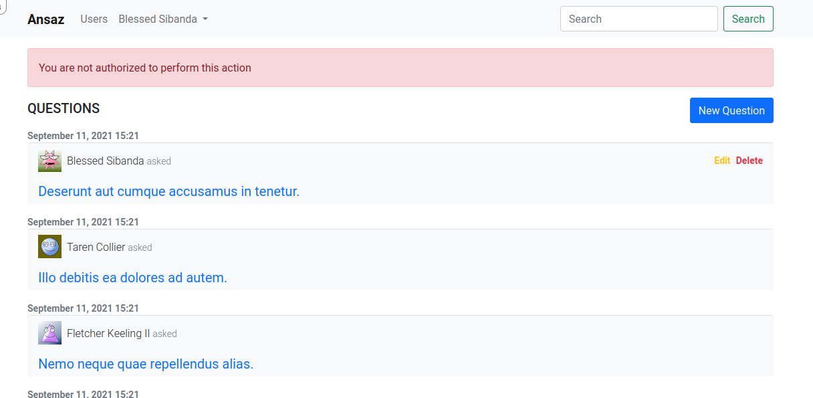

# 5 Asking Questions

In this chapter we are going to allow users to create questions. The questions will be displayed in the home page.

## 5.1 Scaffold questions

```
$ rails g scaffold question title user:references --skip-stylesheets
```

Update `routes.rb` to only allow authenticated users to access `questions` controller actions

```ruby
Rails.application.routes.draw do
  devise_for :users
  authenticate :user do
    resources :users, only: [:index, :show]
    resources :questions
  end
  root to: "home#index"
end
```

Add presence validation to question `title`

```ruby
class Question < ApplicationRecord
  ...
  ...

  validates :title, presence: true
end

```

Run migrations

```
$ rails db:migrate
```

Add `questions` to user model
`app/models/user.rb`

```ruby
class User < ApplicationRecord
  ...
  ...

  has_many :questions
end
```

Refactor question form

- Remove `user_id` from the form fields
- Refactor form errors into a separate partial
- User `bootstrap_form_for` instead of `form_for`

Refactoring form errors

```bash
$ mkdir app/views/shared

$ touch app/views/shared/_form_errors.html.erb
```

```erb
<% if resource.errors.any? %>
  <div id="error_explanation">
    <h2 class='h6'><%= pluralize(resource.errors.count, "error") %> prohibited this <%= resource.class.name.downcase %> from being saved:</h2>
    <ul>
      <% resource.errors.each do |error| %>
        <li class='small'><%= error.full_message %></li>
      <% end %>
    </ul>
  </div>
<% end %>
```

Update question `form` partial
`app/views/questions/_form.html.erb`

```erb
<%= bootstrap_form_with(model: question) do |form| %>
  <%= render 'shared/form_errors', resource: question %>
  <div class="field">
    <%= form.text_field :title %>
  </div>
  <div class="actions">
    <%= form.submit %>
  </div>
<% end %>
```

Add `questions resource` inside the `authenticate :user` block in `config/routes.rb`

```ruby
Rails.application.routes.draw do
  ...
  authenticate :user do
    resources :user_profiles, except: [:destroy, :index]
    resources :questions
  end
  ...
end
```

Update `questions-controller`

- Update the `create` action to assign the questions to the `current_user`

- Remove `:user_id` from 'question_params'

`app/controllers/questions_controller.rb`

```ruby
class QuestionsController < ApplicationController
  ...

  # POST /questions or /questions.json
  def create
    @question = current_user.questions.build(question_params)

    respond_to do |format|
      ...
      ...
    end
  end

  ...

  private

  ...
  ...

  def question_params
    params.require(:question).permit(:title)
  end
end
```

Update questions `index` page

```erb
<div class="d-flex justify-content-between align-items-center my-2">
  <h1 class='h5 text-uppercase'>Questions</h1>
  <%= link_to 'New Question', new_question_path, class: 'btn btn-primary' %>
</div>
<%= render @questions %>
```

Create `question` partial

```bash
$ touch app/views/questions/_question.html.erb
```

`app/views/questions/_question.html.erb`

```erb
<p class='small text-muted fw-bold mb-0 pb-0'><%= question.created_at.to_s(:long) %></p>
<div class="card question-card mt-0 mb-3 border-0 bg-light border-top">
  <div class="card-body py-2">
    <h6 class="card-title fw-light d-flex justify-content-between">
      <div class='d-flex align-items-center'>
        <%= user_avatar(question.user, height: 35, width: 35) %>
        <div class='ms-2'>
          <%= question.user.name %>
          <span class='text-muted small'>asked</span>
        </div>
      </div>
      <div class='d-flex align-items-center'>
        <%= link_to 'Edit', edit_question_path(question), class: 'small fw-bold text-decoration-none link-warning' %>
        <span class="mx-1"></span>
        <%= link_to 'Delete', question, method: :delete, data: {confirm: 'Are you sure?'}, class: 'small fw-bold text-decoration-none link-danger' %>
      </div>
    </h6>
    <h5 class="card-subtitle fw-normal mt-3">
      <%= link_to question.title, question, class: 'text-decoration-none' %>
    </h5>
  </div>
</div>

```

Order questions in descending order(i.e newer questiosns first)

```ruby
class QuestionsController < ApplicationController
  ...
  ...

  def index
    @questions = Question.all.order(created_at: :desc)
  end

  ...
  ...
end
```

Redirect to questions index page when user logs in

```ruby
class HomeController < ApplicationController
  def index
    if user_signed_in?
      redirect_to questions_path
    end
  end
end
```

## 5.2 Add Rich Text to Questions

```bash
rails action_text:install

# Run Migrations
rails db:migrate
```

Add rich text to question model

`question.rb`

```ruby
class Question < ApplicationRecord
  belongs_to :user
  has_rich_text :content
end
```

Update question `form` to include _rich text_

```ruby
<%= bootstrap_form_with(model: question) do |form| %>
  <%= render 'shared/form_errors', resource: question %>
  <div class="field">
    <%= form.text_field :title %>
  </div>
  <div class="field">
    <%= form.rich_text_area :content %>
  </div>
  <div class="actions">
    <%= form.submit %>
  </div>
<% end %>
```

Update questions `new` page

`app/views/questions/new.html.erb`

```erb
<h1 class='h2'>New Question</h1>
<%= render 'form', question: @question %>
<%= link_to 'Back', questions_path %>
```

Update questions `edit` page
`app/views/questions/edit.html.erb`

```erb
<h1 class='h2'>Editing Question</h1>
<%= render 'form', question: @question %>
<%= link_to 'Show', @question %> |
<%= link_to 'Back', questions_path %>
```

Update `questions-controller` to accept question content in `questions_params`

```ruby
def question_params
  params.require(:question).permit(:title, :content)
end
```

Update 'question' partial as follows (so that we can re-use it in both the question index and show page)

```erb
<p class='small text-muted fw-bold mb-0 pb-0'><%= question.created_at.to_s(:long) %></p>
<div class="card question-card mt-0 mb-3 border-0 bg-light border-top">
  <div class="card-body py-2">
    ...
    ...
    <h5 class="card-subtitle fw-normal mt-3">
      <%= link_to question.title, question, class: 'text-decoration-none' %>
    </h5>
    <%= yield if on_question_page? %>
  </div>
</div>

```

Create the `on_question_page?` helper in `questions_helper.rb` to check whether the user is on the `show` question page.

`app/helpers/questions_helper.rb`

```ruby
module QuestionsHelper
  def on_question_page?
    controller.action_name == "show" &&
      controller.controller_name == "questions"
  end
end
```

Display question content in question show page

`app/views/questions/show.html.erb`

```
<%= render @question do %>
  <div class="my-2 pt-1"><%= @question.content %></div>
<% end %>
```

Update the `db/seeds.rb` with questions data

```ruby
...
...

20.times do |i|
  Question.create!(
    user: User.active.sample,
    title: Faker::Lorem.sentence(word_count: rand(5..10)),
    content: Faker::Lorem.sentence(word_count: rand(75..150)),
  )
end
```

Seed the database

```
$ rails db:seed:replant
```

Now if you login and visit the home page, you will see the questions list

## 5.3 User Authorization

We are going to use the `pundit` gem to build a robust authorization system in our application.

```
$ bundle add pundit
```

Include `Pundit` in `ApplicationController`. Handle `Pundit::NotAuthorizedError` by redirecting the user back with an alert message.

```ruby
class ApplicationController < ActionController::Base
  include Pundit
  before_action :configure_permitted_parameters, if: :devise_controller?
  rescue_from Pundit::NotAuthorizedError, with: :pundit_not_authorized

  ...
  ...

  private

  def pundit_not_authorized
    flash[:alert] = "You are not authorized to perform this action"
    redirect_back(fallback_location: root_path)
  end
end

```

Create pundit application policy

```
$ rails g pundit:install
```

Create a pundit question policy

```
$ rails g pundit:policy question
```

Only allow the owner of the question to update/delete a question. To do that, add the `update?` and `destroy?` method in question policy.

`app/policies/question_policy.rb`

```ruby
class QuestionPolicy < ApplicationPolicy
  ...

  def update?
    user == record.user
  end

  def destroy?
    user == record.user
  end
end
```

Update the `Edit` and `Destroy` links in question partial
`_question.html.erb`

```erb
<p class='small text-muted fw-bold mb-0 pb-0'><%= question.created_at.to_s(:long) %></p>
<div class="card question-card mt-0 mb-3 border-0 bg-light border-top">
  <div class="card-body py-2">
    <div>
      <h6 class="card-title fw-light d-flex justify-content-between">
        ...
        ...
        <div class='d-flex align-items-center'>
          <% if policy(question).update? %>
            <%= link_to 'Edit', edit_question_path(question), class: 'small fw-bold text-decoration-none link-warning' %>
          <% end %>
          <span class="mx-1"></span>
          <% if policy(question).destroy? %>
            <%= link_to 'Delete', question, method: :delete, data: {confirm: 'Are you sure?'}, class: 'small fw-bold text-decoration-none link-danger' %>
          <% end %>
        </div>
      </h6>
    </div>
    ...
    ...
  </div>
</div>
```

Update the `question-controller` to use the `question-policy` authorization

```ruby
class QuestionsController < ApplicationController
  before_action :set_question, only: %i[ show edit update destroy ]
  before_action :authorize_question, only: [:edit, :update, :destory]

  ...
  ...

  private

  ...

  def authorize_question
    authorize @question
  end
end
```

Now if you access the `edit` page of a question you did not create, Pundit will deny you access and present you with the following screen.



## 5.4 Tagging Questions

In this chapter we will allow users to tag their questions for easier discoverability and filtering.

Generate Tag model

```
$ rails g model Tag name:uniq
```

Create a tagging model to link our tags and questions

```
$ rails g model Tagging tag:belongs_to question:belongs_to
```

Run migrations

```
$ rails db:migrate
```

Add `taggings` and `questions` to the `Tag` model

```ruby
class Tag < ApplicationRecord
  has_many :taggings
  has_many :questions, through: :taggings
end
```

Update question model with `tagging` related methods. Also add an `after_save` callback to save tag names in lowercase.

```ruby
class Question < ApplicationRecord
  ...

  has_many :taggings
  has_many :tags, through: :taggings
  after_save { name.downcase! }

  def self.tagged_with(name)
    Tag.find_by(name: name).questions
  end

  def self.tag_counts
    Tag.select("tags.*, count(taggings.tag_id) as count").joins
    (:taggings).group("taggings.tag_id")
  end

  def tag_list
    tags.map(&:name)
  end

  def tag_list=(names)
    self.tags = names.split(",").map do |n|
      Tag.where(name: n.strip).first_or_create!
    end
  end
end
```

Update `db/seeds.rb` with a few tags

```ruby
...
...

["JavaScript", "Programming", "Ruby-on-Rails", "Science"].each do |name|
  Tag.create!(name: name)
end
```

Re-seed the database

```
$ rails db:seed
```

Display question tags

`app/views/questions/_question.html.erb`

```erb
<p class='small text-muted fw-bold mb-0 pb-0'><%= question.created_at.to_s(:long) %></p>
<div class="card question-card mt-0 mb-3 border-0 bg-light border-top">
  ...
  ...
  <div class="card-footer d-flex justify-content-between">
    <div>
      <%= render 'stars/stars', starrable: question %>
    </div>
    <div class="d-flex">
      <% question.tags.each do |tag| %>
        <%= link_to "##{tag.name}", '#', class: 'badge tag-item' %>
      <% end %>
    </div>
  </div>
</div>
```

Update `main.scss`

```scss
// previous styles here

a.tag-item {
  background: white;
  color: var(--bs-dark);
  text-decoration: none;
  margin: 0 0.3em;

  &:hover {
    color: white;
    background-color: var(--bs-gray);
  }
}
```

Update question form to include tags

```erb
<%= bootstrap_form_with(model: question) do |form| %>
  <%= render 'shared/form_errors', resource: question %>
  <div class="field">
    <%= form.text_field :title %>
  </div>
  <%= form.hidden_field :group_id, value: question.group&.id %>
  <div class="field">
    <%= form.rich_text_area :content %>
  </div>
  <div data-controller='tag'>
    <label for="">Tags</label>
    <small class="small text-muted">Separate tag names with commas</small>
    <div data-controller="autocomplete" data-autocomplete-url-value="/tags/">
      <input name='question[tag_list]' value='<%= question.tag_list.join(',') %>' type="text" class='form-control' data-tag-target='input' data-autocomplete-target="input"/>
      <ul class="list-group" data-autocomplete-target="results" style="max-height: 10rem; overflow-y: scroll;"></ul>
    </div>
  </div>
  <div class="actions">
    <%= form.submit %>
  </div>
<% end %>
```

Note that we are using markup to with `stimulus-autocomplete` controller. This is provided by the `stimulus-autocomplete` npm package. This package allows us to to make a selection from a list of results fetched from the server. In this case we want to fetch tag names from our server and provide autocomplete as the user types.

Lets install the npm package

```
$ yarn add stimulus-autocomplete
```

Setup `stimulus` to work with this new package

`app/javascript/controllers/index.js`

```javascript
import { Application } from 'stimulus';
import { definitionsFromContext } from 'stimulus/webpack-helpers';
import { Autocomplete } from 'stimulus-autocomplete';

const application = Application.start();
const context = require.context('controllers', true, /_controller\.js$/);
application.load(definitionsFromContext(context));

application.register('autocomplete', Autocomplete);
```

Create the tags rails controller to give us a list of tags

```
$ rails g controller tags index --skip-stylesheets
```

```ruby
class TagsController < ApplicationController
  layout false

  def index
    @tags = Tag.all
  end
end
```

Update routes

```ruby
Rails.application.routes.draw do
  get "tags/index"
  root to: "home#index"
  devise_for :users
  authenticate :user do
    ...
    resources :tags, only: :index
  end
end
```

Create a tags stimulus controller to override the default behaviour of `stimulus-autocomplete`.

To learn more about the `stimulus-autocomplete` package visit its [github page](https://github.com/afcapel/stimulus-autocomplete)

```
$ touch app/javascript/controllers/tag_controller
```

```javascript
import { Controller } from 'stimulus';

var inputValue = '';
export default class extends Controller {
  static targets = ['input'];
  connect() {
    document.addEventListener('autocomplete.change', this.change.bind(this));
    this.inputTarget.addEventListener('keyup', this.inputChanged.bind(this));
  }

  inputChanged(event) {
    if (event.key == ',') inputValue = event.target.value;
    if (this.inputTarget.value == '') {
      inputValue = '';
    }
  }

  change(event) {
    this.inputTarget.value = inputValue;
    if (!this.inputTarget.value.includes(event.detail.textValue)) {
      this.inputTarget.value += event.detail.textValue + ',';
      inputValue = this.inputTarget.value;
    }
  }
}
```

The above controller will allow concatenation of tag names as the user types

Update `questions_params` in questions controller to accept the tag list

```ruby
class QuestionsController < ApplicationController
  ...
  ...

  private

  ...
  def question_params
    params.require(:question).permit(:title, :content, :group_id, :tag_list)
  end
end
```

Now try creating a new question and you will notice the autocomplete feature working on the tag list
