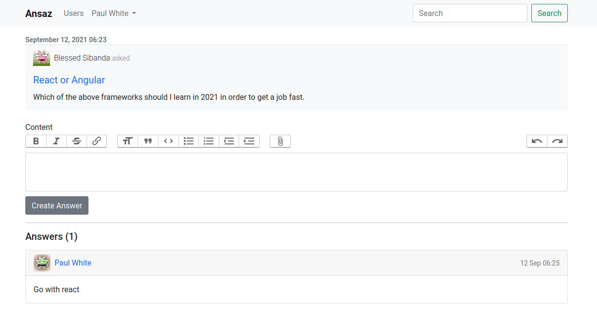
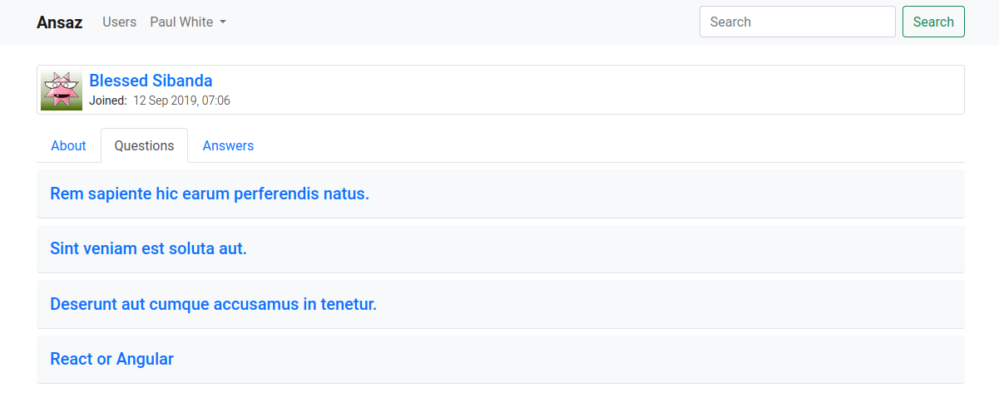
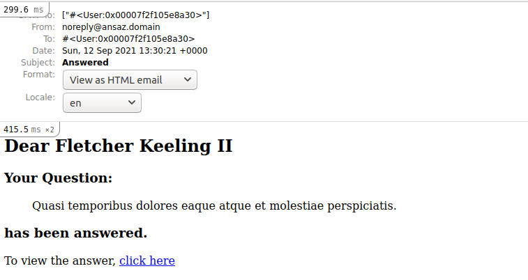

# 6 Answers

In this chapter we will allow users to provide answers to questions. Users will also be able to comment on answers and even on other comments.

## 6.1 Scaffold Answers

Let's generate a scaffold for answers

```bash
$ rails g scaffold answer user:references question:belongs_to accepted:boolean --skip-stylesheets
```

Update the `accepted` field in the migration to have a default value of `false`

```ruby
class CreateAnswers < ActiveRecord::Migration[6.1]
  def change
    create_table :answers do |t|
      t.references :user, null: false, foreign_key: true
      t.belongs_to :question, null: false, foreign_key: true
      t.boolean :accepted, default: false

      t.timestamps
    end
  end
end
```

```bash
rails db:migrate
```

Nest answers routes inside questions
`config/routes.rb`

```ruby
Rails.application.routes.draw do
  devise_for :users
  authenticate :user do
    resources :users, only: [:index, :show]
    resources :questions do
      resources :answers, only: [:create, :destroy]
    end
  end
  root to: "home#index"
end
```

Add rich text to answer model

```ruby
class Answer < ApplicationRecord
  belongs_to :user
  belongs_to :question
  has_rich_text :content
end
```

Update question model with answers

```ruby
class Question < ApplicationRecord
  belongs_to :user
  has_rich_text :content
  has_many :answers
end
```

Update user model with answers

```ruby
class User < ApplicationRecord
  ...
  ...
  has_many :answers
end
```

Update answers controller

- to use current-user as owner of answer

- to load the associated question before creating an answer

- to only accept answer `:content` in `answer_params` method

- to redirect to question page after creating an answers

- remove the `new`, `show`, `edit`, and `update` actions

```ruby
class AnswersController < ApplicationController
  before_action :set_question, only: %i[index create new]
  before_action :set_answer, only: %i[ show edit update destroy ]

  ...
  ...

  def create
    @answer = current_user.answers.build(answer_params)
    @answer.question = @question

    respond_to do |format|
      if @answer.save
        format.html { redirect_to @answer.question,
          notice: "Answer was successfully created." }
        format.json { render :show, status: :created,
          location: @answer }
      else
        format.html { render :new, status: :unprocessable_entity }
        format.json { render json: @answer.errors,
          status: :unprocessable_entity }
      end
    end
  end

  ...
  ...

  private
    def set_answer
      @answer = Answer.find(params[:id])
    end

    def answer_params
      params.require(:answer).permit(:content)
    end

    def set_question
      @question = Question.find(params[:question_id])
    end
end
```

Update answer form

- Remove `:user_id`, `:question_id` and `:accepted` from the form fields
- Use `bootstrap_form_for` instead of `form_for` to style our form
- Add the rich text field for answer content

```erb
<%= bootstrap_form_with(model: [@question, answer]) do |form| %>
  <%= render 'shared/form_errors', resource: answer %>
  <div class="field">
    <%= form.rich_text_area :content %>
  </div>
  <div class="actions">
    <%= form.submit %>
  </div>
<% end %>
```

Show answer 'form' in question 'show' page and display the questions' answers

**app/views/questions/show.html.erb**

```erb
<%= render @question do %>
  <div class="my-2 pt-1"><%= @question.content %></div>
<% end %>
<%= render 'answers/form', answer: Answer.new %>
<hr>
<% if @question.answers.any? %>
  <h5>Answers (<%= @question.answers.count %>)</h5>
<% end %>
<%= render @question.answers %>
```

Create answer partial

```bash
$ touch app/views/answers/_answer.html.erb
```

**app/views/answers/\_answer.html.erb**

```erb
<div class="card my-3 answer-card">
  <div class="card-header d-flex align-items-center justify-content-between">
    <%= link_to answer.user, class: 'd-flex align-items-center' do %>
      <%= user_avatar(answer.user, height: 35, width: 35) %>
      <span class='ms-2'><%= answer.user.name %></span>
    <% end %>
    <span class='text-muted small'>
      <%= answer.created_at.to_s(:short) %>
    </span>
  </div>
  <div class="card-body">
    <%= answer.content %>
    <% if policy(answer).destroy? %>
      <%= link_to 'delete',
      question_answer_path(answer.question, answer),
      method: :delete, remote: true,
       data: {confirm: 'Are you sure?'},
       class: 'float-end delete-link link-danger' %>
      <% end %>
  </div>
</div>
```

Update `main.scss`

```scss
// previous styles here

a.delete-link,
.timestamp {
  font-size: 0.8rem;
  text-transform: lowercase;
}
```

Note that we are using a pundit policy to check whether the user is authorized to delete an answer. Only the creator of the answer can delete it. We are also using `remote: true` option in the delete link to delete answers via ajax.

Let's generate the `answer_policy` to add the `destroy?` authorization.

```bash
$ rails g pundit:policy answer
```

```ruby
class AnswerPolicy < ApplicationPolicy
  def destroy?
    user == record.user
  end
end
```

Add this authorization check to the answers controller `destroy` action

```ruby
class AnswersController < ApplicationController
  ...
  ...

  def destroy
    authorize @answer
    @answer.destroy
    respond_to do |format|
      format.js
    end
  end

  ...
  ...
end
```

Note that we are responding with javascript (ajax) in the destroy action

So lets create the `destroy.js.erb` view

```
$ touch app/views/answers/destroy.js.erb
```

```javascript
var answer = document.getElementById('<%= j dom_id(@answer) %>');
answer.remove();
```

Now if you visit a question page and provide an answer, it looks like the following, and the answer can be destroyed without a full page reload.



## 6.2 Update User Profile Page

In this section, we will update the user profile page to show the user's questions and answers

**app/views/users/show.html.erb**

```erb
<%= render @user %>
<div data-controller='tab'>
  <ul class="nav nav-tabs mt-3">
    <li class="nav-item">
      <a data-tab-target='aboutLink' data-action="click->tab#about" class="nav-link active" href="#">About</a>
    </li>
    <li class="nav-item">
      <a data-tab-target='questionsLink' data-action="click->tab#questions" class="nav-link" href="#">Questions</a>
    </li>
    <li class="nav-item">
      <a data-tab-target='answersLink' data-action="click->tab#answers" class="nav-link" href="#">Answers</a>
    </li>
  </ul>
  <div class="tab-content" id="user-tabs">
    <div data-tab-target="about" class="tab-pane fade show active">
      <div class="lead"><%= @user.about %></div>
    </div>
    <div data-tab-target="questions" class="tab-pane fade">
      <%= render 'questions', user: @user %>
    </div>
    <div data-tab-target="answers" class="tab-pane fade">
      <%= render 'answers', user: @user %>
    </div>
  </div>
</div>
```

Note that we are using `data-controller`, `data-action` and `data-target` attributes in the html. These attributes are required by the `Stimulus JS` library that we will use for the interactivity of our tabs. Stimulus is a small javascript library for sprinkling bits of interactivity in your already existing html.

We already installed Stmulus JS in previous chapter.

Create a stimulus `tab` controller (to make our user tab interactive)

```
$ touch app/javascript/controllers/tab_controller.js
```

**app/javascript/controllers/tab_controller.js**

```javascript
import { Controller } from 'stimulus';

export default class extends Controller {
  static targets = [
    'about',
    'aboutLink',
    'questions',
    'questionsLink',
    'answers',
    'answersLink',
  ];

  reset() {
    this.element.querySelectorAll('ul>li>a.nav-link').forEach((item) => {
      item.classList.remove('active');
    });
    this.element.querySelectorAll('.tab-content>.tab-pane').forEach((item) => {
      item.classList.remove('active');
      item.classList.remove('show');
    });
  }

  about(e) {
    e.preventDefault();
    this.reset();
    this.aboutLinkTarget.classList.add('active');
    this.aboutTarget.classList.add('active');
    this.aboutTarget.classList.add('show');
  }

  answers(e) {
    e.preventDefault();
    this.reset();
    this.answersLinkTarget.classList.add('active');
    this.answersTarget.classList.add('active');
    this.answersTarget.classList.add('show');
  }

  questions(e) {
    e.preventDefault();
    this.reset();
    this.questionsLinkTarget.classList.add('active');
    this.questionsTarget.classList.add('active');
    this.questionsTarget.classList.add('show');
  }
}
```

Create the user `answers` partial to render the user's answers

```
$ touch app/views/users/_answers.html.erb
```

```erb
<% user.answers.each do |answer| %>
  <div class="card my-3 shadow-none border-1">
    <div class="card-header">
      <strong>Question:</strong>
      <%= link_to answer.question.title, answer.question %>
    </div>
    <div class="card-body">
      <%= answer.content %>
    </div>
  </div>
<% end %>
```

Create the user `questions` partial to render the user's questions

```
$ touch app/views/users/_questions.html.erb
```

```erb
<% user.questions.each do |question| %>
  <div class="card my-2 border-0 border-bottom bg-light">
    <div class="card-body">
      <%= link_to question.title, question, class: 'card-title h5' %>
    </div>
  </div>
<% end %>
```

Now if you open a users profile page you see a page similiar to the following



## 6.3 Commenting on Answers

Create a comment model

```bash
$ rails g model comment user:references \
   commentable:references{polymorphic} content:text
```

Run the migrations

```
$ rails db:migrate
```

Comments can be nested inside each other, so `commentable_type` can be either `Comment` or `Answer`

Validate Comment content with a presence validation

```ruby
class Comment < ApplicationRecord
  belongs_to :user
  belongs_to :commentable, polymorphic: true
  validates :content, presence: true
end
```

Add comments to answer model

```ruby
class Answer < ApplicationRecord
  belongs_to :user
  belongs_to :question
  has_rich_text :answer
  has_many :comments, as: :commentable
end
```

Add comments to user model

```ruby
class User < ApplicationRecord
  ...
  ...
  has_many :comments
end
```

Add comments to comment model

```ruby
class Comment < ApplicationRecord
  belongs_to :user
  belongs_to :commentable, polymorphic: true
  validates :comment, presence: true
  has_many :comments, as: :commentable
end
```

Create comments controller

```bash
$ rails g controller comments --skip-stylesheets
```

Update `config/routes.rb`

```ruby
Rails.application.routes.draw do
  devise_for :users
  authenticate :user do
    ...
    ...
    resources :comments, only: [:create, :destroy]
  end
  root to: "home#index"
end
```

Add `create` and `destroy` actions to comments-controller

```ruby
class CommentsController < ApplicationController
  def create
    @comment = Comment.new(comment_params)
    @comment.user = current_user
    if @comment.save
      redirect_back(fallback_location: root_path)
    else
      redirect_back(fallback_location: root_path, alert: "Error creating comment")
    end
  end

  def destroy
    @comment = Comment.find(params[:id])
    authorize @comment
    @comment.destroy
    respond_to do |format|
      format.js
    end
  end

  private

  def comment_params
    params.require(:comment).permit(:content,
                                    :commentable_id, :commentable_type)
  end
end
```

Create the `destroy.js.erb` view

```bash
$ touch app/views/comments/destroy.js.erb
```

```javascript
var comment = document.getElementById('<%= j dom_id(@comment) %>');
comment.remove();
```

Generate the comment policy to allow only the comment owner to destroy a comment.

```bash
$ rails g pundit:policy comment
```

```ruby
class CommentPolicy < ApplicationPolicy
  def destroy?
    user == record.user
  end
end
```

Now let's update `answer` partial to allow for commenting

```erb
<div class="card my-3" id="<%= dom_id(answer) %>">
  ...
  ...
  <div class="card-body">
    <%= answer.content %>
    <div class='mt-2 small text-muted'>
      <%= render 'comments/reply', commentable: answer %>
      <span class="mx-2">&middot;</span>
      <a class='reply-link' href="#" href="#">Replies (<%= answer.comments.count %>)</a>
    </div>
  </div>
  <% comments = answer.comments.select(&:persisted?) %>
  <% if comments.any? %>
    <div class="card-footer bg-transparent">
      <h6>Comments</h6>
      <%= render comments %>
    </div>
  <% end %>
</div>
```

The `comments/reply` partial will contain a link to open a modal with a form to comment on the answer

```bash
$ touch app/views/comments/_reply.html.erb
```

**app/views/comments/\_reply.html.erb**

```erb
<% modal_id = "modal_#{SecureRandom.hex(4)}" %>
<%= render 'shared/modal', id: modal_id,
  title: "Reply #{commentable.class.name}" do %>
  <div class="bg-light p-2">
    <%= commentable.content %>
  </div>
  <%= render partial: 'comments/form',
    locals: {comment: current_user.comments.build,
             commentable: commentable} %>
<% end %>
<a class='reply-link' href="#"
  data-bs-toggle="modal"
  data-bs-target='#<%= modal_id %>'>
  Reply
</a>
```

The reply partial itself will render a modal partial containing the comment form. The modal will have a unique 'id' and will use `yield` to display the content passed to its block.

```bash
$ touch app/views/shared/_modal.html.erb
```

**app/views/shared/\_modal.html.erb**

```erb
<div class="modal fade" id="<%= id %>">
  <div class="modal-dialog">
    <div class="modal-content">
      <div class="modal-header">
        <h5 class="modal-title">
          <%= title %>
        </h5>
        <button type="button" class="btn-close" data-bs-dismiss="modal" ></button>
      </div>
      <div class="modal-body">
        <%= yield %>
      </div>
    </div>
  </div>
</div>
```

Then create the comment form

```bash
$ touch app/views/comments/_form.html.erb
```

```erb
<%= bootstrap_form_with(model: comment) do |form| %>
  <%= render 'shared/form_errors', resource: comment %>
  <%= form.hidden_field :commentable_id, value: commentable.id %>
  <%= form.hidden_field :commentable_type, value: commentable.class.name %>
  <div class="field">
    <%= form.text_area :content, required: true %>
  </div>
  <div class="actions">
    <%= form.submit %>
  </div>
<% end %>
```

Create the 'comment' partial to display the comment and its comments

```
$ touch app/views/comments/_comment.html.erb
```

```erb
<div id='<%= dom_id(comment) %>' class='py-2 border-start border-1 ps-3 pb-0 card border-0 rounded-0 <%= cycle('', 'bg-light') %> '>
  <div class="d-flex justify-content-start align-items-center">
    <%= user_avatar(comment.user, height: 30, width: 30) %>
    <div class='d-flex flex-column ms-2'>
      <%= link_to comment.user.name, comment.user, class: 'mx-1' %>
      <p class='fw-lighter timestamp my-0 ms-1'>
        <%= distance_of_time_in_words_to_now(comment.created_at) %> ago
      </p>
    </div>
  </div>
  <%= comment.content %>
  <div class="d-flex align-items-center justify-content-between pe-3">
    <%= render 'comments/reply', commentable: comment %>
    <% if policy(comment).destroy? %>
      <%= link_to 'delete', comment_path(comment),
          method: :delete, remote: true,
          data: {confirm: 'Are you sure?'},
          class: 'float-end delete-link link-danger' %>
    <% end %>
  </div>
  <%= render comment.comments %>
</div>
```

Update styles in `main.scss`

```scss
// previous styles here ...

a.reply-link,
a.delete-link,
.timestamp {
  font-size: 0.8rem;
  text-transform: lowercase;
}
```

Now our users can comment on answers and even on other comments.

Now that the user can comment on either answers or comments, we want to toggle the comments so that users can view/hide them when they click the `replies` link

To do that, lets create a new stimulus controller

```
$ touch app/javascript/controllers/reply_controller.js
```

Add a method to `toggle` the comments in the controller

`app/javascript/controllers/reply_controller.js`

```javascript
import { Controller } from 'stimulus';

export default class extends Controller {
  toggle(e) {
    e.preventDefault();
    const id = this.data.get('id');
    document.querySelector(`#${id}`).classList.toggle('d-none');
  }
}
```

Now connect the `answer` partial to the `reply_controller` Stimulus controller.

```erb
<div class="card my-3" id="<%= dom_id(answer) %>">
  <div class="card-header d-flex align-items-center justify-content-between">
    ...
    ...
  </div>
  <% comments = answer.comments.select(&:persisted?) %>
  <div class="card-body">
    <%= answer.content %>
    <div class='mt-2 text-muted'>
      <% if answer.accepted %>
        <span class="badge bg-success me-1">
          <i class="fa fa-check-circle"></i>
          <strong>Accepted</strong>
        </span>
      <% end %>
      <%= render partial: 'comments/reply',
        locals: {commentable: answer, answer: answer} %>
      <span class="mx-2">&middot;</span>
      <% if comments.any? %>
        <a class='reply-link' data-controller='reply'
          data-action="click->reply#toggle" href="#"
          data-reply-id="<%= "#{dom_id(answer)}_comments" %>">
            Replies (<%= answer.comments.count %>)</a>
        <span class="mx-2">
          &middot;
        </span>
      <% end %>
    </div>
  </div>
  <% if comments.any? %>
    <div id='<%= "#{dom_id(answer)}_comments" %>' class="card-footer bg-transparent">
      <h6>Comments</h6>
      <%= render comments %>
    </div>
  <% end %>
</div>
```

We are passing the `id` of the related comments in the `data-reply-id` attribute of the reply link. We extract this link in the stimulus controller using `this.data.get('id')`. We then use this `id` to toggle the `d-none` in the stimulus `reply_controller`.

Now the user can toggle the comments and scroll through answers faster.

To improve the user experience, lets submit replies using `Ajax`

First lets update the `create` action in the comments controller to respond to javascript (i.e Ajax) requests

```ruby
class CommentsController < ApplicationController
  def create
    @comment = Comment.new(comment_params)
    @comment.user = current_user
    @answer = Answer.find(params[:comment][:answer_id])
    respond_to do |format|
      if @comment.save
        format.js
      else
        format.js
      end
    end
  end

  ...
  ...
end
```

Next lets update the comment form to submit data using ajax

```erb
<%= bootstrap_form_with(model: comment, data: {remote: true}) do |form| %>
  ...
  ...
<% end %>
```

Create the `create` javascript view

```
$ touch app/views/comments/create.js.erb
```

```javascript
var answer = document.getElementById('<%= j "#{dom_id(@answer)}" %>');

document.querySelectorAll('.modal').forEach((modal) => {
  modal.classList.toggle('show');
});

document.body.classList.toggle('modal-open');

document.body.removeAttribute('data-bs-padding-right');
document.body.removeAttribute('style');

document.querySelectorAll('.modal-backdrop').forEach((m) => {
  m.remove();
});

answer.outerHTML = "<%= j render('answers/answer', answer: @answer) %>";

document
  .querySelector('#<%= "#{dom_id(@answer)}_comments" %>')
  .classList.remove('d-none');
```

Since the form is now submitted via ajax, we will now have to close the modal manually since there is no longer a full page reload. This requires us to undo the bootstrap magic that displays the modal in the page when the `reply` link is clicked. Also note that we are removing the `d-none` class from the replies so as to display the newly added comment.

Now reload the question page and try responding to an answer, you will see that the user experience is now smooth and the reply is posted without a full page reload.

## 6.4 Implement Answer Acceptances

In this section we will allow the question asker to mark answers as accepted.

Let's generate a controller to handle accepting answers

```bash
$ rails g controller answer-acceptance --skip-stylesheets
```

Update the routes

```ruby
Rails.application.routes.draw do
  devise_for :users
  authenticate :user do
    ...
    ...
    resources :answer_acceptance, only: [:update, :destroy]
  end
  root to: "home#index"
end
```

Create a policy to only authorize the asker of the question to mark answers as accepted.

```bash
$ rails g pundit:policy answer
```

```ruby
class AnswerPolicy < ApplicationPolicy
  def accept_or_reject?
    user == record.question.user
  end
end
```

Update the pundit message for the above policy method

```yaml
en:
  pundit:
    default: 'You cannot perform this action.'
    answer_policy:
      accept_or_reject?: 'Only the owner of the question can mark answers as accepted or rejected.'
```

Create the `update` and `destroy` actions in the `answer-acceptance` controller

```ruby
class AnswerAcceptanceController < ApplicationController
  before_action :set_answer, only: %i[update destroy]

  def update
    @answer.accepted = true
    @answer.save
    respond_to do |format|
      format.js { render "answers/answer" }
    end
  end

  def destroy
    @answer.accepted = false
    @answer.save
    respond_to do |format|
      format.js { render "answers/answer" }
    end
  end

  private

  def set_answer
    @answer = Answer.find(params[:id])
    authorize @answer, :accept_or_reject?
  end
end
```

Note the way we are applying the authorization policy in the above controller. We supply the policy method as the 2nd argument to `authorize` if the `action` name doesn't match the authorization policy method we want to apply. So in this case we use (`authorize @answer, :accept_or_reject?`) since we are applying the same authorization to both `create` and `destroy` actions. `accept_or_reject?` is the policy method we are applying from the `AnswerPolicy`. By default, the policy name corresponds to the controller name.

Create the `answers` js view

```
$ touch app/views/answers/answer.js.erb
```

```javascript
var answer = document.getElementById('<%= j dom_id(@answer) %>');
answer.outerHTML = "<%= j render('answers/answer', answer: @answer) %>";
```

Update the `default_scope` in `answer` model to order answers based on acceptance status, stars_count and creation date in descending order.

```ruby
class Answer < ApplicationRecord
  ...
  ...

  default_scope {
    left_joins(:stars).group(:id)
      .order(accepted: :desc)
      .order("COUNT(stars.id) DESC")
      .order(created_at: :asc)
  }
end
```

Note that we are using `left_joins` instead of just `joins` in the above scope because the later will return only the answers with stars.

Create a `decide` partial to accept/reject an answer

```
$ touch app/views/answer_acceptance/_decide.html.erb
```

**app/views/answer_acceptance/\_decide.html.erb**

```erb
<% if policy(answer).accept_or_reject? %>
  <% if answer.accepted %>
    <%= link_to 'reject', answer_acceptance_path(answer),
      method: :delete, remote: true,
      class: 'decide-link' %>
  <% else %>
    <%= link_to 'accept', answer_acceptance_path(answer),
      method: :patch, remote: true,
      class: 'decide-link' %>
  <% end %>
<% end %>
```

Note that the `decide` partial is using `ajax` to update the answer acceptance status

This partial also uses the pundit `policy` method to check whether the current user is authorized to accept or reject in answer in question.

Update `main.scss`

```scss
// previous styles here

a.reply-link,
a.star-link,
a.decide-link,
.timestamp {
  text-decoration: none;
  font-size: 0.8rem;
  text-transform: lowercase;
}
```

Install Font-Awesome 5

```
$ yarn add @fortawesome/fontawesome-free
```

Import font-awesome in `application.js`

```javascript
...
import '@fortawesome/fontawesome-free/css/all';
```

Add the `decide` partial in the `answer` partial and also show an accepted answer with a green marking

`_answer.html.erb`

```erb
<div class="card my-3" id="<%= dom_id(answer) %>">
  <div class="card-header d-flex align-items-center justify-content-between">
    ...
    ...
  </div>
  <div class="card-body">
    <%= answer.content %>
    <div class='mt-2 text-muted'>
      <% if answer.accepted %>
        <span class="badge bg-success me-1">
          <i class="fa fa-check-circle"></i>
          <strong>Accepted</strong>
        </span>
      <% end %>
      <%= render 'comments/reply', commentable: answer %>
      <span class="mx-2">&middot;</span>
      <a class='text-decoration-none reply-link' href="#">Replies (<%= answer.comments.count %>)</a>
      <span class="mx-2">
        &middot;
      </span>
      <div class="float-end"><%= render 'answer_acceptance/decide', answer: answer %></div>
    </div>
  </div>
  <% comments = answer.comments.select(&:persisted?) %>
  <% if comments.any? %>
    <div class="card-footer bg-transparent">
      <h6>Comments</h6>
      <%= render comments %>
    </div>
  <% end %>
</div>
```

## 6.5 Notify Users When Their Questions Are Answered

Generate a mailer to notify the user when his/her question receives an answer

```bash
$ rails g mailer question answered
```

Update `from` address in `application_mailer.rb`

```ruby
class ApplicationMailer < ActionMailer::Base
  default from: 'noreply@ansaz.domain'
  layout 'mailer'
end
```

Update the `question_mailer`

**app/mailers/question_mailer.rb**

```ruby
class QuestionMailer < ApplicationMailer
  def answered(question)
    @question = question

    mail to: question.user
  end
end
```

Call the mailer after an answer is created

`answer.rb`

```ruby
class Answer < ApplicationRecord
  ...
  ...

  after_create { QuestionMailer.answered(question).deliver_later }
end
```

Update the `answered` email templates

**app/views/answered.text.erb**

```erb
Dear <%= @question.user.name %>
Your Question:
<%= @question.title %>
has been answered.
To view the answer,
<%= link_to 'click here', @question %>
```

**app/views/answered.html.erb**

```erb
<h2>Dear <%= @question.user.name %></h2>
<h3>Your Question:</h3>
<blockquote>
  <%= @question.title %>
</blockquote>
<h3>has been answered.</h3>
<p>To view the answer,
  <%= link_to 'click here', @question %>
</p>
```

Update the `question_mailer_preview` as well (to accept the question parameter)

**test/mailers/previews/question_mailer_preview.rb**

```ruby
class QuestionMailerPreview < ActionMailer::Preview
  def answered
    QuestionMailer.answered(Question.first)
  end
end
```

Make sure the dev server is running and visit [http://localhost:3000/rails/mailers/question_mailer/answered](http://localhost:3000/rails/mailers/question_mailer/answered) to preview the email

The html version should look similar to this:



Now answer a question from the browser ui and you will see from the terminal running the server that an email is sent to the question owner.
