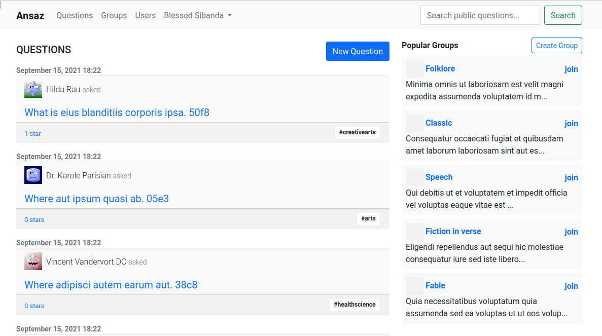
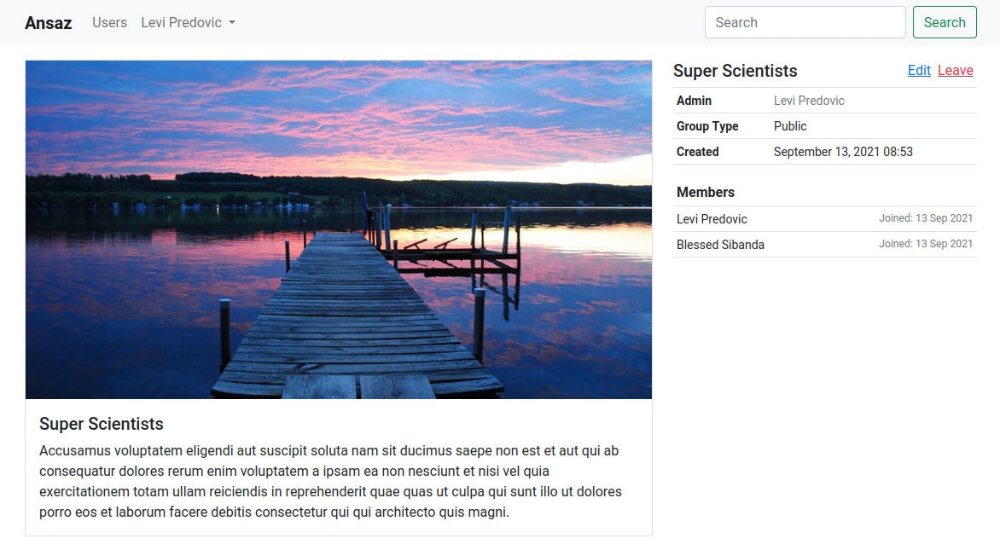

# 9 Joining Groups

In this chapter we will allow users to create and join groups where they can ask and answer questions on specific topics or subjects.

## 9.1 Scaffold Goups

```bash
$ rails g scaffold group name:uniq description:text admin_id:bigint group_type:integer --skip-stylesheets
```

Make `admin_id` a foreign key to `users.id`. Add a default of `0` for the group_type column.

`{timestamp}_create_groups.rb`

```ruby
class CreateGroups < ActiveRecord::Migration[6.1]
  def change
    create_table :groups do |t|
      ...
      ...
    end
    add_index :groups, :name, unique: true
    add_foreign_key :groups, :users, column: :admin_id
  end
end
```

Run the migrations

```bash
$ rails db:migrate
```

Update the group model

- A group can either be public or private, therefore use the `inclusion` validation to validate the group type
- Add a banner image to the group as well
- Add presence validations to `name`, `description` and `banner`
- Validate the length of the group `name`

```ruby
class Group < ApplicationRecord
  belongs_to :admin, class_name: "User", foreign_key: "admin_id"
  has_one_attached :banner

  GROUP_TYPES = [
    PUBLIC = "Public",
    PRIVATE = "Private",
  ].freeze

  validates :name, :description, :banner, presence: true
  validates :name, length: { in: 5..30 }
  validates :group_type, inclusion: { in: GROUP_TYPES }
end
```

Update routes (Place the `resources: groups` inside the `authenticate :user` block)

```ruby
Rails.application.routes.draw do
  devise_for :users
  authenticate :user do
    ...
    ...
    resources :groups
  end
  root to: "home#index"
end
```

Update groups 'form'

```erb
<%= bootstrap_form_with(model: group) do |form| %>
  <%= render 'shared/form_errors', resource: group %>
  <div class="field">
    <%= form.text_field :name %>
  </div>
  <div class="field">
    <%= form.text_area :description %>
  </div>
  <div class="field">
    <%= form.file_field :banner, control_class: "form-control" %>
  </div>
  <div class="field">
    <%= form.select :group_type, Group::GROUP_TYPES %>
  </div>
  <div class="actions">
    <%= form.submit %>
  </div>
<% end %>
```

Unfortunately if you view the new group page, you will notice that `bootstrap_form` gem styles the `file_field` in a weird way by repeating the choose file label. So let's update `main.scss` to hide the extra choose file label.

```scss
@import 'bootstrap';

input[type='submit'] {
  margin-top: 0.6em;
}

form {
  // other styles here

  .custom-file-label {
    display: none;
  }
}

// other styles here
```

Note we are using a select field for the drop down so that a user can select the correct group type.

Update `group_params` and `create` action in `groups-controller`

```ruby
class GroupsController < ApplicationController
  ...
  ...

  def create
    @group = Group.new(group_params)
    @group.admin = current_user

    respond_to do |format|
      ...
      ...
    end
  end

  private
  ...

  def group_params
    params.require(:group).permit(:name, :description, :group_type, :banner)
  end
end
```

## 9.2 Display Groups List

In this section, we will display the group list in the question's page sidebar.

Update the `application.html.erb` layout and make it have a two column layout

```erb
<!DOCTYPE html>
<html>
  <%= render 'layouts/head' %>
  <body>
    <%= render 'layouts/navbar' %>
    <div class="container pt-3">
      <div class="row">
        <div class="col-md-8">
          <%= render 'layouts/flash_messages' %>
          <%= yield %>
        </div>
        <div class="col-md-4">
          <%= yield :sidebar %>
        </div>
      </div>
    </div>
  </body>
</html>
```

Update questions `index` page

`app/views/questions/index.html.erb`

```erb
...
...
<%= content_for :sidebar do %>
  <div class="d-flex justify-content-between align-items-baseline mb-1">
    <h6 class="fw-bold">Popular Groups</h6>
    <%= link_to 'Create Group', new_group_path, class: 'btn btn-outline-primary btn-sm' %>
  </div>
  <%= render Group.popular %>
<% end %>
```

Update the group model with the new scope

```ruby
class Group < ApplicationRecord
  ...
  ...

  scope :ranked, -> {
          joins(:questions, :users).group(:id)
            .order("COUNT(questions.id) DESC")
            .order("COUNT(users.id) DESC")
        }
  scope :popular, -> { ranked.limit(5) }

  def add_admin_to_users
    GroupMembership::Creator.call(user: admin, group: self)
  end
end
```

Create 'group' partial

```
$ touch app/views/groups/_group.html.erb
```

`app/views/groups/_group.html.erb`

```erb
<div class="card py-0 mb-2 border-0 bg-light">
  <div class="card-body py-2 px-2">
    <div class="d-flex justify-content-between align-items-center">
      <h6 class="card-title py-0 my-0">
        <%= group_banner(group, height: 35, width: 35) %>
        <%= link_to group.name, group, class: 'text-decoration-none fw-bold' %>
      </h6>
      <%= link_to 'join', '#' %>
    </div>
    <div class='clearfix'>
      <%= truncate(group.description, length: 80) %>
    </div>
  </div>
</div>
```

Create the `group_banner` helper in `groups_helper.rb`

```ruby
module GroupsHelper
  def group_banner(group, height:, width:)
    render partial: "groups/banner_img",
           locals: { group: group,
                     height: height,
                     width: width }
  end
end
```

Create the `banner_img` partial

```
$ touch app/views/groups/_banner_img.html.erb
```

```erb
<% banner_img_url = group.banner&.variant(resize_to_limit: [height, width]) %>
<%= image_tag banner_img_url, style: "width: #{width}px; height: #{height}px; object-fit: cover;" %>
```

Update the group `show` page

`app/views/groups/show.html.erb`

```erb
<div class="card rounded-0">
  <%= image_tag @group.banner, class: 'card-img-top rounded-0 group-banner' %>
  <div class="card-body">
    <h5 class="card-title"><%= @group.name %></h1>
    <div class="card-text"><%= @group.description %></div>
  </div>
</div>
<%= content_for :sidebar do %>
  <%= render 'sidebar', group: @group %>
<% end %>
```

Update `main.scss`

```scss
// previous styles here

img.group-banner {
  max-height: 60vh;
  object-fit: cover;
}
```

Create the group `sidebar` partial

```
$ touch app/views/groups/_sidebar.html.erb
```

```erb
<table class="table table-sm">
  <thead>
    <th colspan='2'>
      <span><%= group.name %></span>
      <% if policy(group).edit? %>
        <%= link_to 'Edit', edit_group_path(group), class: 'float-end' %>
      <% end %>
    </th>
  </thead>
  <tbody class="small">
    <tr>
      <th>Admin</th>
      <td><%= link_to group.admin.name, group.admin, class: 'text-decoration-none text-secondary' %></td>
    </tr>
    <tr>
      <th>Group Type</th>
      <td><%= group.group_type %></td>
    </tr>
    <tr>
      <th>Created</th>
      <td><%= group.created_at.to_s(:long) %></td>
    </tr>
  </tbody>
</table>
```

Create the group policy

```
$ rails g pundit:policy group
```

```ruby
class GroupPolicy < ApplicationPolicy
  def update?
    user == record.admin
  end

  def destroy?
    user == record.admin
  end

  def edit?
    user == record.admin
  end

  def leave?
    return false if user == record.admin # the admin cannot leave
    GroupMembership.accepted.where(user: user,
                                  group: record).any?
  end

  def join?
    GroupMembership.where(user: user,
                          group: record).empty?
  end
end
```

Update the `groups` controller to use the `group-policy` authorizations

```
class GroupsController < ApplicationController
  before_action :set_group, only: %i[ show edit update destroy ]
  before_action :check_authorization, only: %i[edit update destroy]

  ...
  ...

  private

  ...
  ...

  def check_authorization
    authorize @group
  end
end
```

Add group seed data

`db/seeds.rb`

```ruby
20.times do
  name = Faker::Book.genre
  unless Group.find_by_name(name)
    g = Group.new(
      name: name,
      admin: User.active.sample,
      group_type: Group::GROUP_TYPES.sample,
      description: Faker::Lorem.sentence(word_count: rand(50..80)),
    )
    g.banner.attach(
      io: File.open(Rails.root.join("app", "assets", "images", "default_banner_img.png")),
      filename: "default_banner_img.png",
    )
    g.save!
  end
end
```

Download the `default_banner_img.png` from this books code repository

Re-seed the database

```
$ rails db:seed:replant
```

Now the questions index page looks like


## 9.3 Link Users To Groups

Create a group-membership model

```
$ rails g model group-membership user:references group:references state
```

Update the migration to enforce only one membership for a user per group

```ruby
class CreateGroupMemberships < ActiveRecord::Migration[6.1]
  def change
    create_table :group_memberships do |t|
      ...
      ...
    end
    add_index :group_memberships, [:user_id, :group_id], unique: true
  end
end
```

```
$ rails db:migrate
```

Add validations to `group-membership` model

```ruby
class GroupMembership < ApplicationRecord
  belongs_to :user
  belongs_to :group

  validates_uniqueness_of :user, scope: [:group_id]

  MEMBERSHIP_STATES = [
    PENDING = 'Pending',
    ACCEPTED = 'Accepted'
  ]

  validates :state, inclusion: {in: MEMBERSHIP_STATES}
end
```

Add `group_memberships` and `owned_groups` (these are groups in which the user is an admin) to user model

```ruby
class User < ApplicationRecord
  ...
  ...

  has_many :owned_groups, class_name: "Group", foreign_key: "admin_id"
  has_many :group_memberships
  has_many :groups, through: :group_memberships, source: :group

  def starred(starrable)
    Star.where(user: self, starrable: starrable).first
  end
end
```

Add `group_memberships` and `users` to group model

```ruby
class Group < ApplicationRecord
  ...
  ...

  has_many :group_memberships, dependent: :destroy
  has_many :users, through: :group_memberships, source: :user
end
```

Note that we added a `dependent: :destroy` option to the `group_memberships` relation so that the `group_memberships` are destroy when the related group is destroy. There is no point in keeping group memberships for a non-existent group.

Create a controller to handle joining/leaving groups

```bash
$ rails g controller group-memberships --skip-stylesheets
```

Update the `routes`

```ruby
Rails.application.routes.draw do
  devise_for :users
  authenticate :user do
    ...
    ...

    resources :group_memberships, only: [:update, :destroy]
  end
  root to: "home#index"
end
```

Implement the `update` and `destroy` actions in the `group-memberships` controller

```ruby
class GroupMembershipsController < ApplicationController
  before_action :set_group, only: %i[update destroy]

  def update
    flash[:notice] = GroupMembership::Creator.call(
      user: current_user, group: @group,
    )
    redirect_back(fallback_location: root_path)
  end

  def destroy
    if current_user == @group.admin
      redirect_back(fallback_location: root_path, alert: "Group admin cannot leave")
    else
      GroupMembership.where(user: current_user,
                            group: @group).first.destroy
      redirect_to root_path, alert: "You have left '#{@group.name}' group"
    end
  end

  private

  def set_group
    @group = Group.find(params[:id])
  end
end
```

The `create` actions uses a service to create group-memberships. This technique allows us to move complicated logic out of the controller.

Now the let's create the service

```bash
$ mkdir app/services
```

Create the base application service

```
$ touch app/services/application_service.rb
```

`application_service.rb`

```ruby
class ApplicationService
  def self.call(**args)
    new(**args).call
  end
end
```

All our services will inherit from this `ApplicationService` (Similar to how our controllers inherit from `ApplicationController`). This is good object oriented design.

The service exploses a call class-method which will be used by the service caller to run the service. Methods in a service should be private except for the `call` method only.

Now lets create the service for creating group-memberships

```bash
$ mkdir app/services/group_membership
```

Note that our services are namespaced according to the primary models they work on.

```bash
$ touch app/services/group_membership/creator.rb
```

It is good practice to name your services according to the direct action they perform. (In this case, we are 'creating' group-membership for a user, and hence our service name is `creator`)

```ruby
class GroupMembership::Creator < ApplicationService
  attr_reader :user, :group, :state, :result_message
  private :user, :group, :state, :result_message

  def initialize(user:, group:)
    @user = user
    @group = group
    set_membership_state
  end

  def call
    membership = GroupMembership.find_or_initialize_by(
      state: @state, user: @user, group: @group,
    )
    if membership.persisted?
      @result_message = "You are already in this group"
    else
      membership.save!
    end
    @result_message
  end

  private

  def set_membership_state
    if group.admin == user
      @state = GroupMembership::ACCEPTED
      return
    end
    case group.group_type
    when Group::PUBLIC
      @state = GroupMembership::ACCEPTED
      @result_message = "You have joined '#{group.name}' group"
    when Group::PRIVATE
      @state = GroupMembership::PENDING
      @result_message = "A request to join '#{group.name}' has been sent"
    end
  end
end
```

The logic is fairly straightforward. We are doing a few things:

- After initializing the class, we set the membership state using a case statement. in the `set_membership_state` method.

- The membership state depends on the group-type being joined. If the group is public, then the membership is instant. However, if the group-type is private, the user will need to be approved by the group administrator before joining.

- The case statement is also setting the appropriate 'flash-message' that will be used in the controller to notify the user of the result of the operation.

- If the user joining the group is an admin, then the state is always ACCEPTED (i.e the admin user does not need approval from anyone to join his/her own group.

Update the `group` partial with links to join/leave groups and also to show membership status

`app/views/groups/_group.html.erb`

```erb
<div class="card py-0 mb-2 border-0 bg-light">
  <div class="card-body py-2 px-2">
    <div class="d-flex justify-content-between align-items-center">
      <h6 class="card-title py-0 my-0">
        <%= group_banner(group, height: 35, width: 35) %>
        <%= link_to group.name, group, class: 'text-decoration-none fw-bold' %>
      </h6>
      <div class="">
        <% if policy(group).join? %>
          <%= link_to 'join', group_membership_path(group), class: 'text-decoration-none fw-bold', method: :patch %>
        <% end %>
        <% if current_user.pending_approval group %>
          <span class="badge bg-warning">Pending</span>
        <% end %>
      </div>
    </div>
    <div class='clearfix'>
      <%= truncate(group.description, length: 80) %>
    </div>
  </div>
</div>
```

Update the user model with a `pending_approval` method
`app/models/user.rb`

```ruby
class User < ApplicationRecord
  ...
  ...

  def pending_approval(group)
    group_memberships.where(
      group: group,
      state: GroupMembership::PENDING,
    ).any?
  end
end
```

These methods will be used in various views to check whether a user can join or leave a group; or whether a user's request to join a private group is pending approval.

## 9.4 Approving Group Join Requests

Add `accept` and `reject` actions to group-memberships controller to allow for the group admin to accept or reject group join requests.

```ruby
class GroupMembershipsController < ApplicationController
  before_action :set_group, only: %i[update destroy]
  before_action :set_group_membership, only: %i[accept reject]

  def accept
    @group_membership.state = GroupMembership::ACCEPTED
    @group_membership.save!
    redirect_back(fallback_location: root_path)
  end

  def reject
    @group_membership.destroy
    redirect_back(fallback_location: root_path)
  end

  ...
  ...

  private

  ...
  ...

  def set_group_membership
    @group_membership = GroupMembership.find(params[:id])
    authorize @group_membership, :accept_or_reject?
  end
end
```

Next, let's create a group-membership-policy to only authroize group admins to accept/reject group join requests

```bash
$ rails g pundit:policy group_membership
```

```ruby
class GroupMembershipPolicy < ApplicationPolicy
  def accept_or_reject?
    user == record.group.admin
  end
end
```

Update the routes to include these new actions as well

```ruby
Rails.application.routes.draw do
  root to: "home#index"
  devise_for :users
  authenticate :user do
    ...
    ...
    resources :group_memberships, only: [:update, :destroy] do
      member do
        post :accept
        delete :reject
      end
    end
  end
end
```

Display the group join requests in the group admin's profile page

`app/views/users/show.html.erb`

```erb
<%= render @user %>
<div data-controller='tab'>
  <ul class="nav nav-tabs mt-3">
    ...
    ...
    <li class="nav-item">
      <a data-tab-target='answersLink' data-action="click->tab#answers" class="nav-link">Answers</a>
    </li>
    <% if current_user == @user %>
      <li class="nav-item">
        <a data-tab-target='requestsLink' data-action="click->tab#requests" class="nav-link">Requests</a>
      </li>
    <% end %>
  </ul>
  <div class="tab-content" id="user-tabs">
    ...
    ...
    <div data-tab-target="answers" class="tab-pane fade">
      <%= render 'answers', user: @user %>
    </div>
    <% if current_user == @user %>
      <div data-tab-target="requests" class="tab-pane fade">
        <%= render 'group_memberships/requests', user: @user %>
      </div>
    <% end %>
  </div>
</div>

```

Create the `group_membership/requests` partial

```bash
$ touch app/views/group_memberships/_requests.html.erb
```

```erb
<% @user.owned_groups.each do |group| %>
  <% group.group_memberships.pending.each do |membership| %>
    <div class="card p-2 my-1">
      <div class="d-flex justify-content-between align-items-center">
        <div>
          <strong><%= link_to membership.user.user_profile.name, membership.user.user_profile, class: 'text-decoration-none' %></strong>
          <span class='fw-light'>requests to join</span>
          <strong><%= link_to membership.group.name, membership.group %></strong>
        </div>
        <div>
          <%= link_to 'accept', accept_group_membership_path(membership), method: :post, class: 'link-success' %>
          <%= link_to 'reject', reject_group_membership_path(membership), method: :delete, class: 'link-danger' %>
        </div>
      </div>
    </div>
  <% end %>
<% end %>
```

Create the `pending` and `accepted` scopes in `group_membership` model

```ruby
class GroupMembership < ApplicationRecord
  ...
  ...

  scope :pending, -> { where(state: PENDING) }
  scope :accepted, -> { where(state: ACCEPTED) }
end

```

Update the Stimulus `tab-controller` with the new `requests` tab interactivity

```javascript
import { Controller } from 'stimulus';

export default class extends Controller {
  static targets = [
    'about',
    'aboutLink',
    'questions',
    'questionsLink',
    'answers',
    'answersLink',
    'requests',
    'requestsLink',
  ];

  ...
  ...

  requests() {
    this.reset();
    this.requestsLinkTarget.classList.add('active');
    this.requestsTarget.classList.add('active');
    this.requestsTarget.classList.add('show');
  }
}
```

Update the group sidebar page with a link to leave a group and to display the members of the group

`app/views/groups/_sidebar.html.erb`

```erb
<div class="d-flex justify-content-between mt-3 mt-md-0 border-bottom">
  <h5><%= group.name %></h5>
  <span class="d-flex">
    <% if policy(group).edit? %>
      <%= link_to 'Edit', edit_group_path(group), class: 'mx-1' %>
    <% end %>
    <% if policy(group).leave? %>
      <%= link_to 'Leave', group_membership_path(@group), class: ' link-danger mx-1', method: :delete %>
    <% end %>
    <% if policy(group).join? %>
      <%= link_to 'join', group_membership_path(group), class: 'mx-1', method: :patch %>
    <% end %>
  </span>
</div>
<table class="table table-sm">
  ...
  ...
</table>
<table class='table table-sm'>
  <tr>
    <th>Members</th>
  </tr>
  <% group.users.each do |user| %>
    <tr>
      <td class='small'>
        <%= user.name %>
        <span class='float-end small text-muted'>Joined: <%= user.joined_on(group) %></span>
      </td>
    </tr>
  <% end %>
</table>
```

Update user model with a `joined_on` method (which returns the date when the user joined the group)

```ruby
class User < ApplicationRecord
  ...
  ...

  def joined_on(group)
    group_memberships.where(group: group).
      first&.created_at.strftime("%d %b %Y")
  end
end
```

Finally, lets add the group admin to the group `users` when a group is created.

```ruby
class Group < ApplicationRecord
  after_create :add_admin_to_users

  ...
  ...

  def add_admin_to_users
    GroupMembership::Creator.call(user: admin, group: self)
  end
end
```

```
$ rails db:seed:replant
```

Re-seed the database and open a group page, it should look like the following



## 9.5 Asking in Groups

In this section we will allow our users to ask question in groups and get answers from other group members.

```
$ rails g migration add_group_to_questions group:references
```

Allow `null` in `group_id`

```ruby
class AddGroupToQuestions < ActiveRecord::Migration[6.1]
  def change
    add_reference :questions, :group, null: true, foreign_key: true
  end
end
```

```bash
$ rails db:migrate
```

Add optional group to question model

```ruby
class Question < ApplicationRecord
  ...
  ...
  belongs_to :group, optional: true
end
```

Add questions to group

```ruby
class Group < ApplicationRecord
  ...
  ...
  has_many :questions

  ...
end
```

Add a link to ask questions in group `show` page

```erb
<div class="card rounded-0">
  <%= image_tag @group.banner, class: 'card-img-top rounded-0 group-banner' %>
  <div class="card-body">
    <div class="d-flex justify-content-between">
      <h3><%= @group.name %></h3>
      <div><%= render 'ask', group: @group %></div>
    </div>
    <div class="card-text"><%= @group.description %></div>
  </div>
</div>
<%= content_for :sidebar do %>
  <%= render 'sidebar', group: @group %>
<% end %>
```

Create the ask partial

```
$ touch app/views/groups/_ask.html.erb
```

```erb
<% if policy(group).participate? %>
  <% modal_id = "modal_#{SecureRandom.hex(4)}" %>
  <%= render 'shared/modal', id: modal_id, title: group.name do %>
    <h3>New Question</h3>
    <%= render 'questions/form', question: group.questions.new %>
  <% end %>
  <a class='btn btn-primary' href="#" data-bs-toggle="modal" data-bs-target='#<%= modal_id %>'>
    Ask Question
  </a>
<% end %>
```

The `ask` partial checks whether the user is authorized to ask a question in the group (i.e whether the user is authorized to participate in the group) and renders the question form.

Add the `participate?` method in group policy.

```ruby
class GroupPolicy < ApplicationPolicy
  ...
  ...

  def participate?
    record.active_users.include? user
  end
end
```

Add the `active_users` method in group model

```ruby
class Group < ApplicationRecord
  ...
  ...
  has_many :active_users, -> { GroupMembership.accepted },
           through: :group_memberships, source: :user
end
```

Update the question `form` with a hidden `group_id` field

`app/views/questions/_form.html.erb`

```erb
<%= bootstrap_form_with(model: question) do |form| %>
  <%= render 'shared/form_errors', resource: question %>
  <div class="field">
    <%= form.text_field :title %>
  </div>
  <%= form.hidden_field :group_id, value: question.group&.id %>
  <div class="field">
    <%= form.rich_text_area :content %>
  </div>
  <div class="actions">
    <%= form.submit %>
  </div>
<% end %>
```

Update `question_params` to accept `group_id` in questions controller

```ruby
class QuestionsController < ApplicationController
  ...

  def index
    @questions = Question.ungrouped.order(created_at: :desc)
  end

  def create
    @question = current_user.questions.build(question_params)
    authorize(@question.group, :participate?) if @question.group

    respond_to do |format|
      ...
      ...
    end
  end

  private
  ...

  def set_question
    @question = Question.find(params[:id])
    authorize(@question.group, :participate?) if @question.group
  end

  def question_params
    params.require(:question).permit(:title, :content, :group_id)
  end
end
```

Add a `public` scope in `question` model to retrieve questions without groups.

```ruby
class Question < ApplicationRecord
  ...
  scope :ungrouped, -> { where(group_id: nil) }
end
```

Update group `show` page to display questions in group

```erb
<div class="card rounded-0">
  ...
</div>
<br>
<% if policy(@group).participate? %>
  <h1 class='h5 text-uppercase'>Questions</h1>
  <%= render @group.questions.select(&:persisted?) %>
<% else %>
  <div class="card bg-light p-3 rounded-0">
    <h5 class='text-danger'>The questions in this group can only be seen by the group members</h5>
    <p class='my-0'>Join the group to view the questions and participate</p>
  </div>
<% end %>
<%= content_for :sidebar do %>
  <%= render 'sidebar', group: @group %>
<% end %>
```

## 9.5 Display Group List

In this section we are going to create a group list where users can browse the available groups.

Let's start by adding extra links in our `navbar` partial.

```erb
<nav class="navbar navbar-expand-lg navbar-light bg-light sticky-top">
  <div class="container">
    ...
    <div class="collapse navbar-collapse" id="navbarSupportedContent">
      <ul class="navbar-nav me-auto mb-2 mb-lg-0">
        <% if user_signed_in? %>
          <li class="nav-item">
            <%= link_to 'Questions', questions_path, class: 'nav-link' %>
          </li>
          <li class="nav-item">
            <%= link_to 'Groups', groups_path, class: 'nav-link' %>
          </li>
          <li class="nav-item">
            <%= link_to 'Users', users_path, class: 'nav-link' %>
          </li>
          <li class="nav-item dropdown">
            ...
          </li>
        <% else %>
          ...
        <% end %>
      </ul>
      ...
    </div>
  </div>
</nav>
```

Update the group index page

`app/views/groups/index.html.erb`

```erb

```

Update the group index page with a nice formatted table showing the group names and their types

```erb
<div class="d-flex align-items-center justify-content-between">
  <h1 class='h2'>Groups</h1>
  <%= link_to 'New Group', new_group_path, class: 'btn btn-primary' %>
</div>
<table class='table mt-3 table-hover'>
  <thead>
    <tr>
      <td>Rank</td>
      <td>Name</td>
      <td>Type</td>
    </tr>
  </thead>
  <tbody>
    <% @groups.each.with_index do |group, index| %>
      <tr>
        <td><%= index + 1 %></td>
        <td class='h5'>
          <%= link_to group.name, group,
              class: 'text-decoration-none' %>
        </td>
        <td class='text-muted text-end'><%= group.group_type %></td>
      </tr>
    <% end %>
  </tbody>
</table>
<%= will_paginate @groups,
    renderer: WillPaginate::ActionView::BootstrapLinkRenderer %>
```

Update the groups controller to provide paginated results

```ruby
class GroupsController < ApplicationController
  before_action :set_group, only: %i[ show edit update destroy ]
  before_action :check_authorization, only: %i[edit update destroy]

  def index
    @groups = Group.paginate(page: params[:page])
  end

  ...
  ...
end
```

Add more groups in `db/seeds.rb`

```ruby
...
...

40.times do
  name = Faker::Book.genre
  unless Group.find_by_name(name)
    g = Group.new(
      name: name,
      admin: User.active.sample,
      group_type: Group::GROUP_TYPES.sample,
      description: Faker::Lorem.sentence(word_count: rand(50..80)),
    )
    g.banner.attach(
      io: File.open(Rails.root.join("app", "assets", "images", "default_banner_img.png")),
      filename: "default_banner_img.png",
    )
    g.save!
  end
end

2_000.times do |i|
  include FactoryBot::Syntax::Methods
  q = create :question
  tags = []
  rand(1..3).times.each do
    tags << Faker::Educator.subject.downcase.gsub(/[^A-Za-z-]/, "")
  end

  q.tag_list = tags.uniq.join(",")

  if i % 5 == 0 # one in 5 questions belongs to a group
    q.group = Group.all.sample
    q.save
  end

  if i % 100 == 0
    print(".")
  end
end
```

## 9.6 Popular and Recommended Questions

In this section we will display the top questions in the groups index page. Questions are ranked by the number of stars and answers they have.

Add the popular questions list in the sidebar of the group index page.

`app/views/groups/index.html.erb`

```erb
...
...
<%= content_for :sidebar do %>
  <h6 class="fw-bold">Top Questions</h6>
  <% Question.ungrouped.popular.each do |question| %>
    <div class="card p-2 my-2 rounded-0 bg-light">
      <h6 class="card-title py-1 my-0">
        <%= link_to question.title, question, class: 'text-decoration-none' %>
      </h6>
    </div>
  <% end %>
<% end %>
```

Update question model with the `popular` and `ungrouped` scopes

```ruby
class Question < ApplicationRecord
  ...
  ...

  scope :ungrouped, -> { where(group_id: nil) }

  scope :popular, -> {
      left_joins(:stars, :answers).group(:id)
        .order("COUNT(stars.id) DESC")
        .order("COUNT(answers.id) DESC")
        .limit(10)
    }

  ...
  ...
end
```

In the next sub-section we will display questions with similar tags in the question show page.
